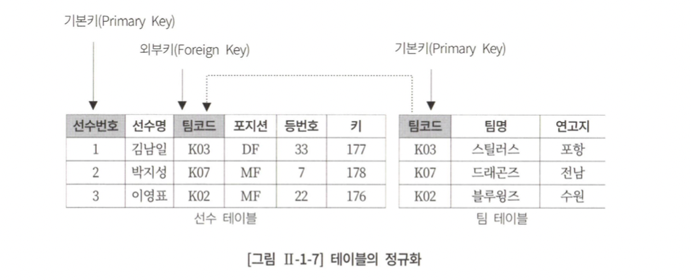
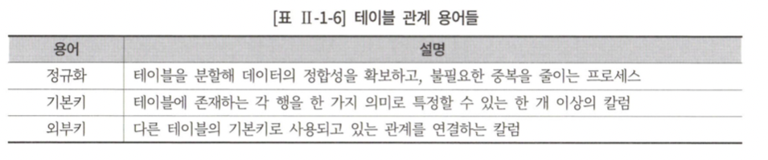
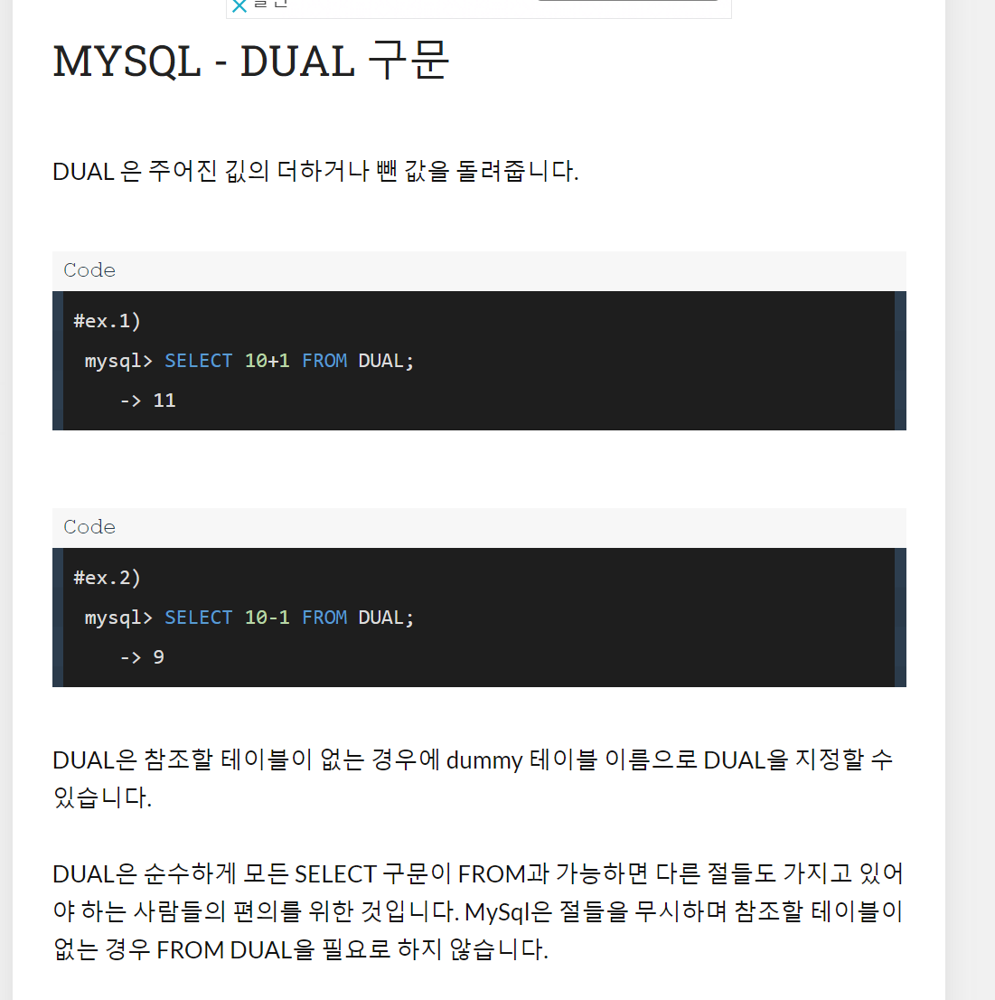

## 1장 . SQL 기본

### 제1절. 관계형 데이터 베이스 개요
---
> `SQL` : 관계형 데이터베이스에서 데이터의 정의, 조작, 제어를 위해 사용되는 언어


**SQL 종류**

| 명령어의 종류  | 명령어 | 설명 |
|:---:|:---:|:---:|
| 데이터 조작어 (DML) | SELECT  | DB내 데이터를 조회/검색을 위한 명령어 (*RERIEVE : 데이터 탐색의 의미)
|| INSERT <br/> UPDATE <br/> DELETE  | DB 테이블 내 데이터를 변경하는 명령어 |
| 데이터 정의어 (DDL) | CREATE <br/> ALTER <br/> DROP <br/>RENAME | 테이블과 같은 데이터 구조 정의를 위해 사용되는 명령어 구조를 생성/변경/삭제 및 이름 변경은 DDL. |
| 데이터 제어어 (DCL) | GRANT <br/> REVOKE  | 데이터베이스에 접근하고 객체를 사용할 수 있도록 권한 부여, 회수하는 명령어  |
| 트랜잭션 제어어 (TCL) | COMMIT <br/> ROLLBACK | DML에 의해 조작된 결과를 트랜잭션 별로 제어하는 명령어  |

#### ANSI/ISO 표준 

- 표준 조인 기능 추가 (CROSS, OUTER JOIN 등 새로운 FROM 절 JOIN 기능들)
- SCALAR, SUBQUERY, TOP-N QUERY 등의 SUBQUREY 기능들
- ROLLUP, CUBE, GROUPING SETS등의 새로운 리포팅 기능 ( [그룹함수](https://sewonzzang.tistory.com/59) 기능)
- 🔗 [WINDOWS FUNCTION](https://velog.io/@yewon-july/Window-Function) 과 같은 새로운 분석 기능들

- 일반 집합 연산자
    - UNION (중복 제거 필요시 UNION ALL절 사용)
    - INTERSECT
    - EXCEPT **(오라클은 MINUS)**
    - CROSS JOIN (PRODUCT 연산)

- 순수 관계 연산자
    - WHERE절
    - SELECT절
    - JOIN
    

#### 테이블 

> 관계형 데이터베이스의 기본단위
> 
> 
> 데이터를 저장하는 객체
> 모든 데이터는 테이블에 등록됨 (일종의 집합 개념)

<div align="center">
    
    
</div>

### 제2절. SELECT

---

```sql
SELECT [ALL/DISTINCT] 출력대상 컬럼명, ...FROM 테이블명;
```

### 제3절. 함수

---

- 내장 함수
- 사용자 정의 함수

> Dual
> 
> 
> dual 은 펑션이나 계산식을 테이블 생성없이 수행해 보기 위한 용도로 사용하는 일종의 'dummy' 테이블이다.
> 
> ⇒ **어떤 값이 들어있는 것이 아니라 임시의 공간이라고 생각하면 된다.**
> 
> - temp 테이블과는 다른 개념인가?
>     
>     (MSSQL에서는 오라클과 같이 dual이라는 가상 테이블이 X, 따라서, 별도 구현이 필요)
>     
>     ⇒ MySql은 절들을 무시하며 참조할 테이블이 없는 경우 FROM DUAL을 필요로 하지 않습니다.
>           
>       

<div align="center">
    
</div>

> 
> - dual 테이블은 오라클에서 자동으로 생성되는 테이블이다.
> - dual 테이블은 sys 스키마에 있지만 모든 사용자가 엑세스할 수 있다.
> - dual 테이블은 VARCHAR2(1)로 정의된 dummy라고 하는 하나의 컬럼으로 되어 있다.
>     - 컴럼과 차수가 모두 1인 더미 테이블
> - dual 테이블은 사용자가 함수(계산)를 실행할 때 임시로 사용하는데 적합하다.
> 

> **[NULLIF](https://gent.tistory.com/480)** (n1, n2)
: n1과 n2가 같으면 NULL, 같지않으면 n1을 반환하는 함수
> 

### 제5절. GROUP BY, HAVING 절

---

### 제6절. ORDER BY 절

---

### 제7절. 조인

---

### 제8절. 표준 조인

---
