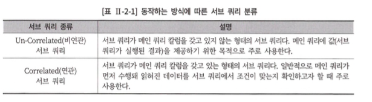
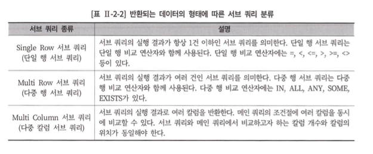
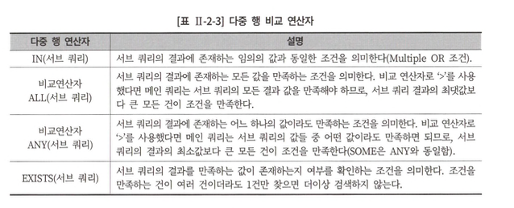
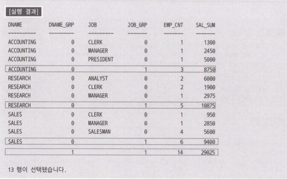
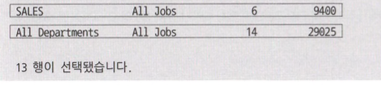
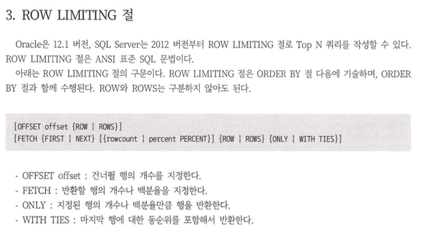
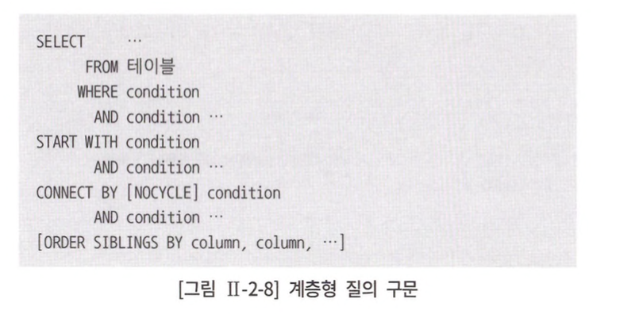
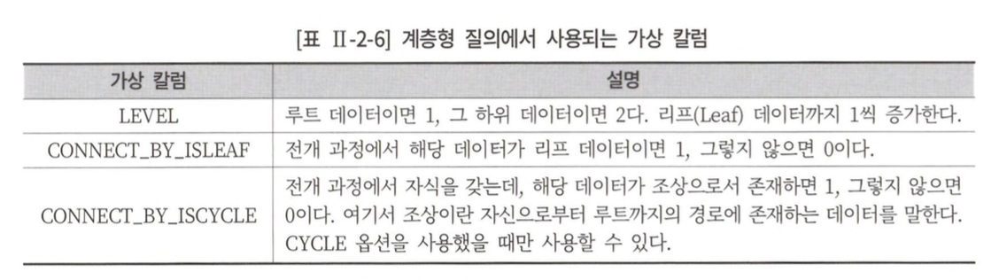
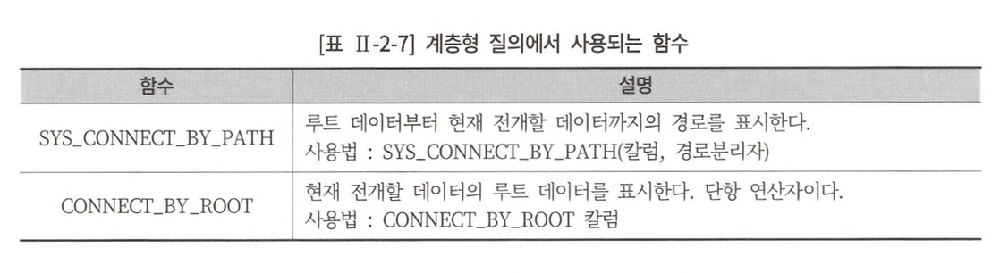

# 2장. SQL 활용 
## 제 1절. 서브 쿼리

> 메인 쿼리가 서브 쿼리를 포함하는 종속적인 관계
> 

### 조인 vs 서브 쿼리

#### 1. 조인 

- 조인에 참여하는 모든 테이블이 대등한 관계를 맺음으로, 모든 테이블의 컬럼을 자유롭게 사용 가능
- 1:M 관계의 테이블 조인 시, 1*M 의  결과 집합을 생성

#### 2. 서브 쿼리 

- 서브 쿼리의 경우 메인 쿼리가 서브 쿼리의 컬럼을 사용할 수 없음
    - 사용하려면? 조인 변환/ 함수/ 스칼라 서브 쿼리
- 서브 쿼리는 메인 쿼리 레벨로 결과 집합이 생성
    - ex) 메인 쿼리 (1), 서브 쿼리 (N) → 결과 : 1
- ⚠️ 주의사항 ⚠️
    - 단일 행 또는 복수 행 비교 연산자와 함께 사용이 가능하나,
    - `단일행 비교 연산자`의 경우 서브 쿼리 결과가 반드시, 1건 이하 일 것
    - 복수행 비교연산자는 서브쿼리 결과 건 수에 영향 🙅🏻
    - `중첩 서브 쿼리` 및 `스칼라 서브 쿼리`에는 *ORDER BY* 구문 사용 🙅🏻

### 서브 쿼리 분류

1. 동작 방식 
   
<div align="center">
    
</div>     
    
2. 반환되는 데이터 형태

<div align="center">
    
</div>     


논리적인 수행 순서는 메인 쿼리에서 데이터를 읽고 서브 쿼리에서 조건을 만족하는지 확인하는 방식이 맞으나, 실행결과는 다를 수 있음 

#### 단일 행 비교 연산자 

`단일 행 비교 연산자`를 사용할 경우 쿼리 결과가 2건 이상이면 에러 🚨

(mssql에서 단일행 비교 연산자 사용시 쿼리 결과가 2건 이상일 시, 친절하게 에러 표시를 해줘요)

#### 다중 행 비교 연산자 

<div align="center">
    
</div>     

#### 다중 컬럼 서브 쿼리 

- `서브 쿼리의 결과로 여러개의 컬럼이 반환되어, 메인 쿼리 조건과 동시에 비교되는 것` (SQL Server X, 오라클과 mariaDB O)
- 즉, 여러개의 컬럼을 검색하는 서브 쿼리
- 🤙🏻 `비교 대상 컬럼과 1:1 비교 후 검색하므로, 비교대상과 컬럼 개수가 일치해야함`

```sql
SELECT TEAM_ID AS 팀코드,
       PLAYER_NAME AS 선수명,
       POSITION AS 포지션 ,
			 BACK_NO AS 백넘버, 
		   HEIGHT AS 키
FROM PLAYER
WHERE (TEAM_ID, HEIGHT) IN (SELECT TEAM_ID, 
																		MIN(HEIGHT)
														FROM PLAYER 
														GROUP BY TEAM.ID)
ORDER BY TEAM_ID, PLAYER_NAME;
```

#### 연관 서브 쿼리 

서브 쿼리 내 메인 쿼리의 컬럼이 사용된 서브 쿼리. 

🚀 **EXISTS 연산자** 

> 조건을 만족하는 경우가 n건일지라도, 1건의 조건을 탐색 시, 추가적인 검색을 진행하지 않는다. 

🔗[EXISTS vs COUNT](https://velog.io/@chanbro/COUNT-vs-EXISTS)
> 

#### 그 밖의 서브 쿼리 

가. SELECT 절에 서브 쿼리 사용 

> Scalar SubQuery : 1 row, 1 column만 반환하는 함수로 SELECT절에 사용
> 

나. FROM 절에 서브 쿼리 사용

<details>
<summary> ✅ 인라인 뷰</summary>

<div markdown="1">

> from 절에 사용되는 서브쿼리 <br/>
> 
> 
> 서브 쿼리의 결과를 마치 테이블 처럼 사용이 가능하다. <br/>
> 
> 인라인 뷰에서는 *ORDER BY* 절 사용이 가능 
> 

</div>
</details>

다. having 절에 서브 쿼리 사용하기

<details>
<summary> ✅  뷰</summary>

<div markdown="1">

> 뷰는 데이터를 저장하지 않고도 데이터를 조회할 수 있다. <br/>
> 
> 
> 생성 : CREATE VIEW AS 생성할 VIEW의 select문; <br/>
> 
> 삭제 : DROP VIEW 뷰명; <br/>
> 

</div>
</details>

## 제 2절. 집합 연산자

집합과 집합을 연결하는 집합 연산자  

## 제 3절. 그룹함수

> 데이터 분석을 위한 ANSI/ISO SQL 표준에서 3가지 함수를 정의 <br>
> 

| Function  | Contents |
| --- | --- |
| AGGREGATE | - 집계 함수를 의미
- COUNT, SUM, AVG, MAX, MIN 외 집계 함수들이 포함되어있음  |
| GROUP | - 소계, 중계, 합계, 총합계와 같은 레벨 별 집계를 할  수 있게 하는 함수
- CUBE, ROLLUP, GROUPING SETS 함수가 존재  |
| WINDOW | - 분석 및 순위를 내는 함수 
- RANK, ROW_NUMBER 함수가 존재 |

<details>
<summary> ✏️1. Group Function </summary>

<div markdown="1">

### 1. ROLLUP 함수

> 소그룹 간의 소계를 계산하기 위한 함수 <br/>
`Grouping Column의 수가 n개일 경우, n+1의 소계결과가 생성된다.`
> 
> 
> ⚠️ ROLLUP의 인수는 계층 구조로 인수의 순서에 따라 수행결과가 상이함.
> 
> ***→ 계층 내, GROUP BY가 수행될 때, 별도 정렬을 지원하지않아 ORDER BY절과 함께 사용해야함***
> 

### 2. GROUPING 함수

> `그룹함수 (ROLLUP, CUBE, GROUPING SETS) 지원을 위해 도입된 함수`
> 
> 
> 👀 소계 또는 총합등 집계된 데이터일 경우 ⇒ `GROUPING(EXPR) = 1` 표시.
>       그 외 결과는 `GROUPING(EXPR) = 0`
> 
> 즉,집계된 데이터이면 *1* 을 리턴, 아닌 경우 *0*을 리턴
> 
> ex] 암시적 조인을 사용하여 ROLLUP을 수행한 소계 결과에 그룹핑 함수를 적용
> 
> ```sql
> SELECT B.DNAME, GROUPING (B.DNAME) AS DNAME_GRP
> , A.JOB , GROUPING (A.JOB ) AS JOB_GRP
> , COUNT (*) AS EMPJZNT, SUM (A.SAL) AS SAL_SUM
> FROM EMP A, DEPT B
> WHERE B.DEPTNO = A.DEPTNO
> GROUP BY ROLLUP (B.DNAME, A.JOB) ORDER BY B.DNAME, A.JOB;
> ```
> 
> 결과]
> 
> <div align="center">
>    
> </div>     
>
> 
> ✅ GROUPING + CASE 사용으로 NULL 값에 대한 처리가 유용해짐 
> 
> <div align="center">
>    
> </div>     
> 
> - [DECODE](https://gent.tistory.com/227) 함수 ? 
> - 오라클에서만 지원 
> - CASE ~ WHEN 구문 사용을 대체할 수 있음!
>     
>     ```sql
>     SELECT DECODE(컬럼, 조건1, 결과1, 조건2, 결과2 ...) ~
>     ```
>     
>      - MySQL에는 [IF](https://hellogk.tistory.com/22) 함수가존재
>     
>     ```sql
>     SELECT IF(조건, 조건이 일치할 때 값, 조건 불일치시 값) ~
>     ```
>     
>     - Sql Server는 [IIF](https://gent.tistory.com/374) 함수 존재, 사용법은 MySQL과 동일 (해당 함수는 ver 2012부터 지원) 
>     

### 3. CUBE 함수

> 결합 가능한 모든 값에 대한 다차원 집계를 생성 
→ 다차원 소계 기능을 수행하는 함수 

 👉🏻 `**GROUPING 컬럼이 가질 수 있는 모든 경우의 수에 대한 소계를 계산**`
> 
> 
> 
> ✅ 내부적으로 Grouping Columns의 순서를 변경해서 또 쿼리를 수행, 총계가 쿼리마다 모두 생성 
> → `ROLLUP 대비 연산 대상이 많음` (시스템 부담 🆙)
> 

### 4. GROUPING SETS 함수

> ✔️ 수평 구조로 인수의 순서가 변경되어도 결과는 동일. (↔ 계층적 구조인 ROLLUP 과 대조)
> ✔️ GROUPING SETS에 표시되는 인수들에 대한 개별 집계가 가능
> 

</div>
</details>

## 제 4절. 윈도우 함수

[Window함수](https://doorbw.tistory.com/221)

> `행과 행간의 관계를 정의하거나, 행간의 비교 연산을 수행하기 위한 함수`
> 
> 
> ⇒ 개별 데이터들에 대한 연산 결과를 출력해주는 분석 함수 
> 
> WINDOW FUNCTION 는 크게 5가지 그룹으로 분류할 수 있다. 
> 
> 1. 그룹 내 순위(RANK) 관련 함수: RANK, DENSE_RANK, ROW_NUMBER
> 2. 그룹 내 집계(AGGREGATE) 관련 함수 : SUM, MAX, MIN, AVG, COUNT 
> 3. 그룹 내 행 순서 관련 함수 : *FIRST_VALUE, LAST_VALUE, LAG, LEAD (SQL SERVER 미지원)*
> 4. 그룹 내 비율 관련 함수 : CUME_DIST, PERCENT_RANK, NTILE, RATIO_TO_REPORT
> 5. 선형 분석을 포함한 통계 분석 함수
> 
> ```sql
> SELECT WINDOWS_FUNCTION (인수) OVER ([PARTITION BY 컬럼][ORDER BY 절][WINDOWING 절])
> ```
> 
> - 윈도우 함수는 OVER 문구가 필수로 포함됨
> - 윈도우 함수 문법의 의미
>     - WINDOW_FUNCTION : 함수를 의미 `ex) SELECT [컬럼] , **RANK () OVER ( ... )**`
>     - PARTITION BY절
>         - 전체 row 집합을 소그룹 분할 ⇒ 행분할 (생략 가능) ⇒ 생략시, 전체 행에 대한 처리
>     - ORDER BY 절 : 정렬 (생략 가능)
>     - WINDOWING 절 : 함수의 대상이 되는 행 기준의 범위를 지정 (SQL Server에서는 지정 X)
>         - ROWS : 물리적인 결과 행 수
>         - RANGE : 논리인 값에 의한 범위
>         
>     
>     <details>
>     <summary> ✏️ RANK </summary>
>     
>     <div markdown="1">
>     
>     #### RANK 함수 
>     
>     > 순위 함수로서, 동일한 값에 대한 동일 순위를 부여, `동일 순위다음 순위 : 동일 순위 데이터의 순번 의 동일 순위 + 동일 순위 발생 개수`  (중복 허용)
>     > 
>     
>     ####  DENSE_RANK 함수 
>     
>     > 순위함수이나, 동일한 순위를 하나의 건수로 처리함 `동일 순위 다음의 순위는 해당 동일 순위의 순번 다음 순위를 부여 => 순번 + 1`(중복 허용)
>     > 
>     
>     #### ROW_NUMBER 함수 
>     
>     > 중복을 허용 X, 하나의 데이터는 유니크한 순위를 부여받는다.
>     > 
>     
>     </div>
>     </details>
>     
>     <details>
>     <summary> ✏️ 그룹 내 행 순서 함수 </summary>
>     
>     <div markdown="1">
>     
>     #### FIRST_VALUE 함수 
>     
>     > 파티션 별 윈도우에서 먼저 나온 값을 구한다. (SQL Server 미 지원) 
>     MIN 함수를 활용해 동일 결과 도출이 가능.
>     
>     **RANGE** UNBOUNDED PRECEDING : 현재 행을 기준으로 파티션 1번째 행까지의 범위를 지정한다. (디폴트)
>     [https://gent.tistory.com/473](https://gent.tistory.com/473)
>     > 
>     
>     #### LAST_VALUE 함수
>     
>     > 파티션 별 윈도우에서 가장 마지막 값을 구함
>     > 
>     
>     #### LAG 함수 
>     
>     > 파티션 별 윈도우에서 이전 몇 번째 행의 값을 가져온다. [현재행 기준]
>     LAG 함수는 3개의 ARGUMENTS까지 사용할 수 있다.
>     > 
>     
>     #### LEAD 함수 
>     
>     > 파티션 별 윈도우에서 다음 몇번째의 행을 가져온다. [현재 행 기준]
>     > 
>     
>     [오라클 LAG와 LEAD 함수](https://gent.tistory.com/339)
>     
>     </div>
>     </details>
>     

## 제 5절. Top N 쿼리

🔗 [OLTP](https://in-harvey-it.tistory.com/10) : OLAP과 대조되는 개념으로,  일련의 작업을 중요한 관점으로 본다. 
데이터 저장을 중요 관점으로 여겨, HW 용량, 분산 처리 및 정규화를 중요시함(OLAP의 경우는 데이터 분석을 목적으로 두고, 대용량 데이터 조회시 유용 → 반정규화, 메모리 성능을 중요 관점으로 둠)

<div align="center">
    
</div>     

## 제 6절. 계층형 질의와 셀프 조인

#### 오라클 계층형 질의 

<div align="center">
    
</div>     

- START WITH : 계층 구조 전개의 시작 위치를 설정
    - 루트 데이터를 지정
- CONNECT BY : 다음 전개될 자식 데이터를 지정
    - 자식 데이터는 `CONNECT BY` 의 조건을 만족하여야 한다.
- PRIOR : CONNECT BY절에 사용됨
    - 현재 읽은 컬럼을 지정한다.
- NOCYCLE
    - 데이터 전개 시, 동일 데이터 발생 시, Cycle이 발생
    - 사이클 발생 시, 런타임 오류가 발생
    - 따라서, 런타임 오류를 방지하고 사이클 이후의 데이터 전개를 방지
- ORDER SIBLINGS BY : 동일 노드 사이에서 정렬을 수행.
- WHERE : 전개 수행 후 필터링
    
<div align="center">
    
</div>     


[LPAD](https://gent.tistory.com/190) 함수란? 왼쪽부터 지정된 문자를 채우는함수, option 미 지정시, 공백 문자를 채운다.  (오른쪽 부터 문자채우기는 RPAD함수가 있음)  

[오라클에서 지원하는 함수]
<div align="center">
    
</div>     

- SQL Server에서 재귀 호출을 위해서 [WITH 과CTE](https://learn.microsoft.com/ko-kr/sql/t-sql/queries/with-common-table-expression-transact-sql?view=sql-server-ver16)를 사용한다.
    
    → CTE 사용 남발은 성능 저하를 야기
    

## 제 7절. PIVOT 절과 UNPIVOT 절

- 엑셀과 동일한 기능
    - PIVOT : 행 → 열 , 집계 함수를 지원
    - UNPIVOT : 열 → 행
        
        > FOR절 : (언)피벗할 열을 지정  
        IN 절 : (언)피벗할 열값을 지정 (IN절 내, 각 컬럼명을 별칭 지정하는 것이 제안됨)
        > 
        > 
        > `PIVOT 절은 집계함수와 FOR 절에 지정되지 않은 열을 기준으로 집계되기 때문에 **인라인 뷰* 를 통해 사용할 열을 지정해야 한다.` ⇒ `*`from절에 조회 쿼리 
        > 
        

✅ 피벗과 언피벗 함수는 `오라클 11g 버전부터 지원된다.`

📌 문법 

```sql
--1. [PIVOT](https://devgsp.tistory.com/51)
SELECT * FROM (피벗 대상 쿼리문)
PIVOT (
	그룹화할 집계함수 (컬럼)
  FOR 피벗할 컬럼 
  IN (항목1, 항목2 ...)
);
--2. [UNPIVOT](https://gent.tistory.com/382)
SELECT * FROM (언피벗 대상 쿼리문)
UNPIVOT(
	그룹화할 집계함수 (컬럼)
  FOR 언피벗할 컬럼 
  IN (항목1, 항목2 ...)
);
```

## 제 8절. 정규 표현식

> REGXEP_SUBSTR : 정규 표현식을 사용하기 위한 함수
> 
> 
> 해당 함수를 사용하여 패턴 매칭되는 결과를 반환한다. 
> 일치하지않는 경우 null을 반환
> 

 

#### 연산자의 종류 

| 유형  | 연산자  | 설명 |
| --- | --- | --- |
| POSIX  | . | 모든 문자와 일치  |
|  | | | 대체 문자를 구분 |
|  | \ | 다음 문자를 일반 문자로 취급  |
| Anchor  |  | 검색 패턴의 시작과 끝을 설정  |
|  | ^ | 문자열 시작  |
|  | $ | 문자열 끝 |
| Quantifier (수량사) | ?  | 0 | 1회 일치  |
|  | * | 0회 | 그이상의 횟수로 일치  |
|  | +  | 1회 |  그이상의 횟수로 일치  |
|  | {m} | m회 일치  |
|  | {m,} | 최소 m회 일치  |
|  | {,m} | 최대  m회 일치  |
|  | {m,n} | 최대 m 회, 최대 n회 일치  |
| 역참조  | \n | n번째 서브 표현식과 일치, n은 1에서 9 사이의 정수 |
| 문자리스트 | [char---] | 문자리스트 중 한문자와 일치  |
|  | [^char---] | 문자리스트에 제외된 한 문자와 일치  |
|  | [:xdigit:] | 16진수 ([0-9a-fA-F]와 동일) |
|  | [:blank:] | 공백문자  |
|  | [:space:] | 공간 문자 (space, enter, tab) |
|  | [:punct:] | 구두점 기호 ( [A[:alnum:] [:cntrl:]]와 동일) |
- REGEXP_LIKE 조건
    - `REGEXP_LIKE (source_char, pattern [, match_param])`
    → `source_char` : 검색 문자열 지정
        
        → `pattern` : 검색 패턴 지정 
        
        → `match_param` : 일치 옵션을 지정 
        
    - source_char가 pattern과 일치하면 TRUE를, 일치하지 않으면 FALSE를 반환
- REGEXP_REPLACE 함수 (mssql에 Replace 함수가 있어 특정 문자로 대체하는 점이 유사)

    <div align="left">
        
    </div>     
