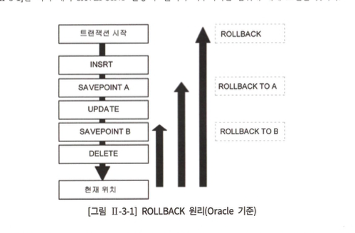
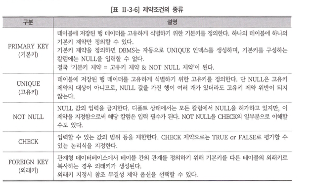
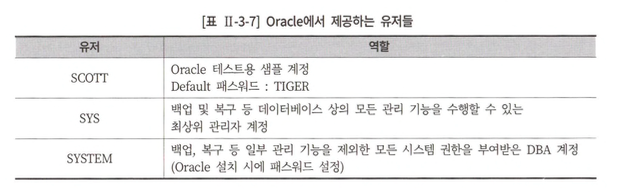
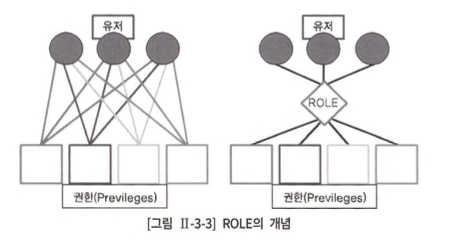

# 3장. 관리 구문 
 `SQL 종류 : DML, DDL, DCL, TCL`
## 1절. DML (Data Manipulation Language)

---

> 관리할 자료들은 테이블에 입력, 수정, 삭제

#### 1. INSERT

```sql
# 1. 단일 INSERT 문 
INSERT INTO 테이블명 [(칼럼1, 칼럼2, ...)] VALUES (값1, 값2, ...);

# 2. 서브 쿼리를 이용한 다중 행 INSERT문 
INSERT INTO 테이블명 [(칼럼1, 칼럼2, ...)] VALUES (값1, 값2, ...);
```

- INTO 절의 테이블 컬럼명과 VALUES 절의 값을 1:1 매핑해서 기술
- INTO절에 기술하지않은 컬럼은 Default로 NULL 값이 입력됨 <br/>
    `(단, PK/ Not NULL 제약이 지정된 칼럼은 NULL을 허용하지 않아 오류 발생.)`

- INTO 절의 컬럼명을 지정하지 않은 경우 VALUES절에 INTO절에 생략된 컬럼의 순서대로 값을 기술해야한다.

- 서브 쿼리의 결과가 다중 행일 경우 한번에 n건이 입력된다.
    - 단, into절의 컬럼 명 개수와 서브쿼리의 SELECT 절 칼럼 개수가 일치해야한다.
     

    > SELECT * INTO ~ vs INSERT INTO SELECT ~  <br/>
    > 🔗 [INSERT INTO SELECT문과 SELECT INTO 문 차이점](https://woogie-db.tistory.com/66) 

    - INSERT INTO SELECT
        - 다른 테이블의 데이터를 일괄 삽입
        - 원본 테이블과 복사 대상 테이블이 모두 존재하는 경우 사용한다.

#### 2. UPDATE 

```sql
UPDATE 테이블명
SET 수정할 칼럼명1 = 수정될 새로운 값1
		[ ,수정할칼럼명2=수정될새로운값2] 
		[ , ... ]
[WHERE수정대상식별조건식] ;
```

- SET절에 서브쿼리를 사용해서 값을 변경할 수도 있음 (NULL 주의)
- WHERE절도 마찬가지로 서브쿼리 사용가능

#### 3. DELETE 

```sql
DELETE [FROM] 테이블명
[WHERE 삭제 대상 식별 조건식] ;
```

#### 4. MERGE 

> INSERT, UPDATE, DELETE를 한번에 작업할 수 있다.
> 

```sql
MERGE INTO [타겟 테이블명] AS TARGET 
USING [소스 테이블명] AS SOURCE 
ON (조건문)
#조건을 만족하는 경우 
WHEN MATCHED THEN 
UPDATE SET [수정할 컬럼 명 = '수정할 값1'],
... [수정할 컬럼 명 = '수정할 값n']
#조건을 만족하지 않는 경우 
WHEN NOT MATCHED [BY TARGET] THEN 
#NOT MATCHED BY TARGET이 생략됨(타겟 테이블에 데이터가 없는 경우를 의미)
INSERT [(컬럼1, 컬럼2, ...)] VALUES (값1, 값2, ...)
WHEN NOT MATCHED BY SOURCE THEN DELETE 
#소스 테이블에 없고 타겟 테이블에 존재하는 데이터
#UPDATE/DELETE 구문만 사용 가능 
;
```

- using문 : 비교할 테이블 또는 서브 쿼리를 기술한다.

- DELETE 문에는 WHERE 조건문을 작성하지 않는다.
필요시 `WHEN 절`에 조건을 작성한다.
- DELETE문은 `WHEN NOT MATCHED` 절에 사용할 수 없다.

🔗 [MSSQL MERGE 구문](https://gent.tistory.com/371)

## 2절. TCL

---

> ✅ 트랜잭션이란 ?
> 
> - 데이터 베이스의 논리적인 연산단위
> - 트랜잭션 내에서 변경된 데이터를 반영 / 취소

| command | description |
| :---: | :---: |
| commit | 데이터를 DB에 반영  |
| rollback | 데이터를 트랜잭션 시작 이전의 상태로 되돌리는 것  |
| savepoint | 트랜잭션 일부만 취소할 수 있게 만드는 저장점  |

- 배타적 lock
    - 쓰기잠금이라고도 불림
    - 트랜잭션에서 데이터를 변경하고자 할 때, 해당 트랜잭션이 완료되기 전 다른 트랜잭션에서 읽기/쓰기 작업을 못하게  하는 잠금 행위

#### 트랜잭션의 특성 

| 특성  | 설명  |
| :---: | :---: |
| 원자성 (atomicity) | 트랜잭션에 정의된 연산들은 모두 성공적으로 실행되거나, 전혀 실행되지 않은 상태로 남아있어야 한다.  <br/> 1. 트랜잭션 작업의 무중단성을 보장 (commit과 rollback으로 보장) |
| 일관성 (consistency) | 트랜잭션이 실행되기 전의 DB 내용과 트랜잭션이 실행된 이후 내용은 동일. |
| 고립성 (격리성) (isolation) | 트랜잭션 실행 중 다른 트랜잭션의 영향이 없도록 보장. |
| 지속성 (durability) | 성공적으로 수행된 트랜잭션은 영원히 저장됨. |

- 트랜잭션의 특성 (특히, 원자성)을 보장하기 위해 다양한 레벨의 잠금 기능을 제공
- 잠금이 걸린 데이터는 잠금 실행한 트랜잭션만 독점적으로 접근하고, 해제할 수 있다.

1. 암시적 트랜잭션
`Oracle과 같은 방식으로 처리된다.`
    - 즉, 트랜잭션의 시작은 DBMS가 처리.
    - 트랜잭션의 끝은 사용자가 명시적으로 COMMIT 또는 ROLLBACK으로 처리.
    - 인스턴스 단위 또는 세션 단위로 설정.
    - 인스턴스 단위로 설정하려면 서버 속성 창의 연결화면에서 기본연결 옵션 중 암시적 트랜잭션에 체크해 주면 된다.
    - 세션 단위로 설정하기 위해서는 세션 옵션 중 SET IMPLICIT TRANSACTION ON을 사용하면 된다.

1. 명시적 트랜잭션
`트랜잭션의 시작과 끝을 모두 사용자가 명시적으로 지정하는 방식.`

```sql
BEGIN
	SET NOCOUNT ON;

	SET @P_RESULT_CODE = 'S';
	SET @P_RESULT_MESSAGE = '정상처리';

	DECLARE @P_COMPANY_UUID			NVARCHAR(36)	= '54e52f42-02ea-436c-bb15-393c8c15d8c4';
	
	BEGIN TRAN SP_DEPARTMENT_SET
	BEGIN TRY
		BEGIN
		-------------------------------------------------------------
		-- 1. HR -> TEMP
		-------------------------------------------------------------
		TRUNCATE TABLE HR_DEPT_TEMP;
				
		INSERT INTO HR_DEPT_TEMP
		SELECT		A.name
				,	A.code
				,	A.parentcode 
				,	A.sortorder
				,	A.displayyn
				,	A.deleteyn
				,	A.reg_datetime
		FROM SKRHr.dbo.HR_dept A

		-------------------------------------------------------------
		-- 2. TEMP -> V_TEMP 
		-------------------------------------------------------------
		TRUNCATE TABLE TB_DEPARTMENT_TEMP;
		
		--DECLARE @P_COMPANY_UUID			NVARCHAR(36)	= '54e52f42-02ea-436c-bb15-393c8c15d8c4';
		INSERT INTO TB_DEPARTMENT_TEMP
		(
				DEPARTMENT_UUID
			,	DEPARTMENT_CD
			,	DEPARTMENT_NAME
			,	DEPARTMENT_NAME_EN
			,	ORDER_NUMBER
			,	COMPANY_UUID
			,	MANAGER_USER_ID
			,	DEPT_DEPTH
			,	PARENT_DEPARTMENT_UUID
			,	REG_DATETIME
			,	UPDATE_DATETIME
			,	DEL_YN
		)
		-- IF. 부서 코드 존재 -> 기존 부서 UUID, ELSE. 미 존재 -> 부서 UUID 생성

		SELECT CASE 
					WHEN B.DEPARTMENT_UUID IS NOT NULL THEN B.DEPARTMENT_UUID									
					ELSE NEWID() 
				END as DEPARTMENT_UUID
			,	A.code
			,	A.name
			,	NULL -- EN 
			,	A.sortorder
			,	@P_COMPANY_UUID
			,	NULL -- 매니저 UUID
			,	NULL -- DEPT_DEPTH 
			,	(SELECT DEPARTMENT_UUID FROM TB_DEPARTMENT WHERE DEPARTMENT_CD = A.parentcode) -- 부모 UUID 
			,	A.reg_datetime
			,	GETDATE() 
			,	CASE A.deleteyn 
					WHEN 'Y' THEN 1
					WHEN 'N' THEN 0
				END
		FROM HR_DEPT_TEMP A
		LEFT MERGE JOIN TB_DEPARTMENT B
		ON A.code = B.DEPARTMENT_CD

		---- 부모 UUID 업데이트 
		UPDATE	TB_DEPARTMENT_TEMP
		SET		PARENT_DEPARTMENT_UUID = (SELECT DEPARTMENT_UUID FROM TB_DEPARTMENT_TEMP WHERE DEPARTMENT_CD = B.parentcode) 
		FROM	TB_DEPARTMENT_TEMP A JOIN  HR_DEPT_TEMP B 
		ON A.DEPARTMENT_CD = B.code AND A.PARENT_DEPARTMENT_UUID = NULL

		-------------------------------------------------------------
		-- 3.  V_TEMP -> V
		-------------------------------------------------------------
		MERGE	TB_DEPARTMENT tb1
		USING 
		(
			SELECT		DEPARTMENT_UUID
					,	DEPARTMENT_CD
					,	DEPARTMENT_NAME
					,	DEPARTMENT_NAME_EN
					,	ORDER_NUMBER
					,	COMPANY_UUID
					,	MANAGER_USER_ID
					,	DEPT_DEPTH
					,	PARENT_DEPARTMENT_UUID
					,	REG_DATETIME
					,	UPDATE_DATETIME
					,	DEL_YN

			FROM TB_DEPARTMENT_TEMP
		) tb2
		ON (tb1.DEPARTMENT_CD = tb2.DEPARTMENT_CD)
		WHEN MATCHED THEN 
			UPDATE SET		tb1.DEPARTMENT_NAME			= tb2.DEPARTMENT_NAME			
						,	tb1.DEPARTMENT_NAME_EN		= tb2.DEPARTMENT_NAME_EN
						,	tb1.ORDER_NUMBER			= tb2.ORDER_NUMBER			
						,	tb1.COMPANY_UUID			= tb2.COMPANY_UUID			
						,	tb1.MANAGER_USER_ID			= tb2.MANAGER_USER_ID
						,	tb1.DEPT_DEPTH				= tb2.DEPT_DEPTH
						,	tb1.PARENT_DEPARTMENT_UUID	= tb2.PARENT_DEPARTMENT_UUID
						,	tb1.UPDATE_DATETIME			= tb2.UPDATE_DATETIME
						,	tb1.DEL_YN					= tb2.DEL_YN

		WHEN NOT MATCHED THEN 
			INSERT
			(
					DEPARTMENT_UUID
				,	DEPARTMENT_CD
				,	DEPARTMENT_NAME
				,	DEPARTMENT_NAME_EN
				,	ORDER_NUMBER
				,	COMPANY_UUID
				,	MANAGER_USER_ID
				,	DEPT_DEPTH
				,	PARENT_DEPARTMENT_UUID
				,	REG_DATETIME
				,	UPDATE_DATETIME
				,	DEL_YN				
			)
			VALUES
			(
					tb2.DEPARTMENT_UUID
				,	tb2.DEPARTMENT_CD
				,	tb2.DEPARTMENT_NAME
				,	tb2.DEPARTMENT_NAME_EN
				,	tb2.ORDER_NUMBER
				,	tb2.COMPANY_UUID
				,	tb2.MANAGER_USER_ID
				,	tb2.DEPT_DEPTH
				,	tb2.PARENT_DEPARTMENT_UUID
				,	tb2.REG_DATETIME
				,	tb2.UPDATE_DATETIME
				,	tb2.DEL_YN				
			)
			;
						
			COMMIT TRAN SP_DEPARTMENT_SET;
		END
	END TRY
	
	BEGIN CATCH
		SET @P_RESULT_CODE     = 'E';
		SET @P_RESULT_MESSAGE = ERROR_MESSAGE();
		ROLLBACK TRAN SP_DEPARTMENT_SET;
	END CATCH
END
```

#### SAVEPOINT 

> 현 시점에서 SAVEPOINT까지 트랜잭션의 일부만 롤백
> 
> 
> > 복수의 savepoint를 저장 
> 동일한 이름으로 n개의 저장점을 정의 시, 마지막 저장점만 유효.
> > 
> 
> - Rollback의 원리
> <div align="center">
>    
> </div>     
>     
> 
> ✅ 특정, 저장점까지 롤백 시, 그 저장점 이후의 설정한 저장점은 무효가 됨.
> 

<aside>
💡 커밋과 롤백의 목적

- 테이블에 데이터의 변경을 발생시키는 INSERT/UPDATE/DELETE 명령어 수행 시, 변경되는 데이터의 무결성을 보장하는 것
</aside>

SQL Server의 트랜잭션 :  DBMS가 트랜잭션을 컨트롤하는 방식인 AUTO COMMIT이 기본 방식

> 다음의 경우는 Oracle과 같이 자동으로 트랜잭션이 종료된다.
> 
> - 애플리케이션의 이상 종료로 데이터베이스(인스턴스)와의 접속이 단절됐을 때는 트랜잭션이 자동으로 롤백된다.

## 3절. DDL (Data Definition Language)

---

> 테이블은 DB의 가장 기본적인 객체 
테이블의 구조를 생성/변경/삭제
> 

#### CREATE TABLE 

```sql
CREATE TABLE 테이블명 
(
	칼럼명1 데이터 유형 [기본값] [NOT NULL]
, 칼럼명2 데이터 유형 [기본값] [NOT NULL]
, 칼럼명3 데이터 유형 [기본값] [NOT NULL]
 ... 
);
```

#### 제약조건 

> 데이터의 무결성 보장을 위한 조건
> 

[이미지 1-1 제약조건 종류]
> <div align="center">
>    
> </div>     

CHECK 제약조건 추가 오라클 예시)

```sql
ALTER TABLE dbo.DocExc   
   ADD ColumnD int NULL   
   CONSTRAINT CHK_ColumnD_DocExc   
   CHECK (ColumnD > 10 AND ColumnD < 50);  
   
-- 정상케이스
INSERT INTO dbo.DocExc (ColumnD) VALUES (49);  

-- 비정상 케이스.
INSERT INTO dbo.DocExc (ColumnD) VALUES (55);
```

 → 입력범위를 벗어나는 경우 에러발생 

⭐ 테이블 구조 확인 명령어 

- 오라클
    - `DESCRIBE[또는 축약어 DESC] 테이블 명;`
- SQL Server
    - `EXEC sp_help [dbo].[테이블명] 
    GO`
    - dbo 스키마 생략 가능 (database owner의 약자입니닷. 디비 생성하면 기본 스키마로 db에서 생성해줍니다.)

#### ALTER TABLE 

- ADD COLUMN
    
    ```sql
    #MSSQL 
    ALTER TABLE 테이블명
    	ADD 추가할 컬럼명1 데이터 유형 [기본 값] [NOT NULL];
    
    #ORACLE
    ALTER TABLE 테이블명
    	ADD (추가할 컬럼명1 데이터 유형 [기본 값] [NOT NULL]);
    ```
    

 새로 추가된 컬럼은 테이블의 마지막 컬럼이되어 위치조정이 불가하나, SQL GUI 툴을 사용하여 조정 가능.

- DROP COLUMN
    - 데이터 유무와 관계없이 삭제 가능
    - `**단, 칼럼 삭제 후 최소 1개 이상의 컬럼이 테이블에 존재해야함**`

```sql
# 오라클 
ALTER TABLE 테이블명 DROP (컬럼명);

# MSSQL 
ALTER TABLE 테이블명 COLUMN 컬럼명;
```

- MODIFY COLUMN
    - 테이블에 존재하는 컬럼의 `데이터 타입 및 길이` , `디폴트 값` , `NOT NULL` 제약 조건에 대한 변경

```sql
# 오라클 
ALTER TABLE 테이블명 
		MODIFY (칼럼명1 데이터 유형 [기본 값] [NOT NULL], ...);

#MSSQL 
ALTER TABLE 테이블명 ALTER COLUMN 컬럼명 데이터 유형 [NOT NULL];	
```

 👉🏻 **컬럼 변경시 주의사항** 

- 컬럼의 `디폴트 값` 을 변경하면, 변경 작업 이전 행에는 영향 X
- 컬럼에 NULL값이 없을 경우만 NOT NULL 제약 조건을 추가할 수 있다.

- RENAME COLUMN
    
    > ANSI/ISO에 명시된 기능이 아닌, 일부 dbms에서만 지원
    > 
    
    ```sql
    #오라클 
    ALTER TABLE 테이블명 RENAME COLUMN 기존컬럼명 TO 새로운컬럼명;
    
    #MSSQL 
    sp_rename '기존컬럼명', '새로운컬럼명', 'COLUMN';
    ```
    

- DROP CONSTRAINT
    
    > 제약조건 삭제 명령어
    > 
    
    ```sql
    ALTER TABLE 테이블명 DROP CONSTRAINT 제약조건명;
    ```
    

- ADD CONSTRAINT
    
    > 기존 테이블 내 제약조건 추가
    > 
    
    ```sql
    ALTER TABLE 테이블명 ADD CONSTRAINT 제약조건명 제약조건 (컬럼명);
    ```
    

#### RENAME TABLE 

```sql
#오라클 
RENAME 기존테이블명 TO 새로운테이블명;

#MSSQL 
sp_rename '기존테이블명', '새로운테이블명';
```

#### DROP TABLE 

```sql
DROP TABLE 테이블명 [CASCADE CONSTRAINT];
```

- CASCADE CONSTRAINT : 삭제 대상 테이블과 관계되어있는 참조되는 제약조건을 삭제하는 옵션
    - `MSSQL은 캐스케이드 옵션이 존재하지않아 참조 테이블 선 삭제가 필요`

#### TRUNCATE TABLE 

> 테이블 내 모든 행을 삭제한다. 
저장 공간 재사용을 가능하게 함 (테이블 용량이 초기화됨)
성능적인 측면에서 트랜잭션 로그에 1번 기록되므로 DELETE문 대비 좋음
> 
> 
> 롤백이 불가합니다… 또륵
> 

```sql
TRUNCATE TABLE 테이블명;
```

## 4절. DCL

---

> 데이터베이스에 대한 객제들에 대한 권한을 제어하는 명령어 <br/>
> <div align="center">
>    
> </div>     
  
#### ROLE을 이용한 권한 부여 
> 유저들과 권한들 사이에서 중개 역할 <br/>
> <div align="center">
>    
> </div>     

- 사용자 및 사용자 생성 테이블 삭제

    ```SQL 
    DROP USER 사용자명 CASCADE;
    ```