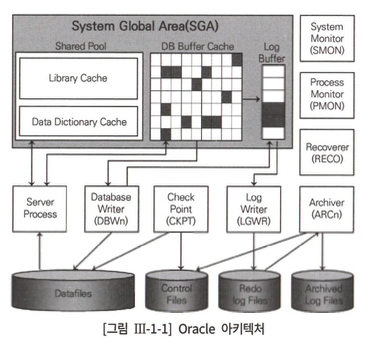
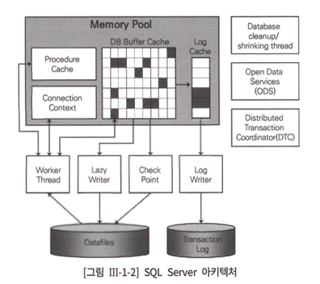
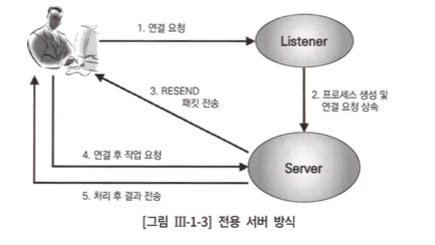
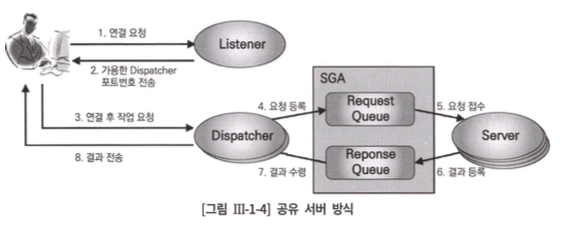
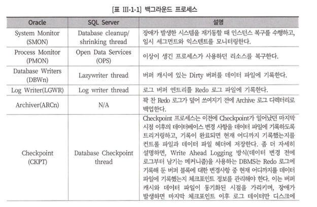
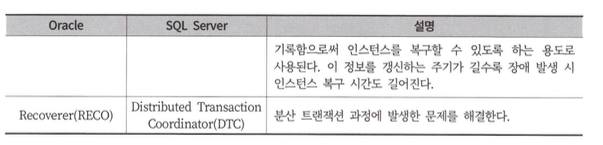
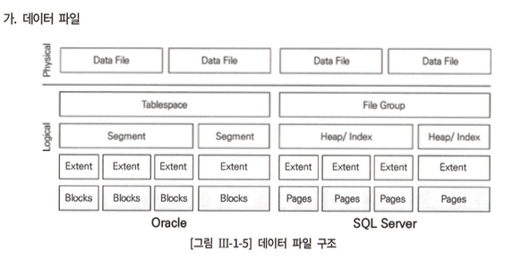
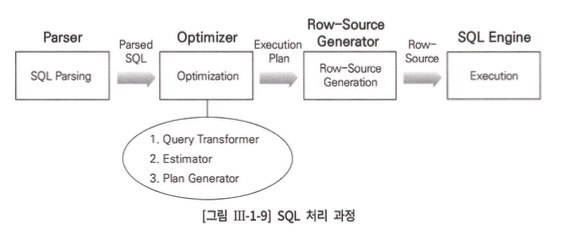
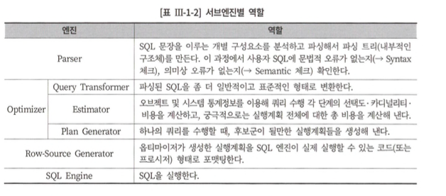
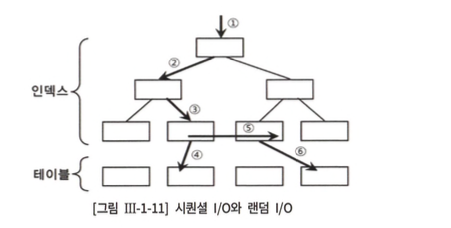

    

     

 제 1절. 데이터베이스 아키텍처  
 

## 1. 데이터베이스 구조

DBMS에 따른 db 정의가 상이함.

|  오라클 | SQL Server | 
|:---:|:---:|

| 

| 

 |

| 디스크에 저장된 데이터 집합 (Datafile, Redo Log File, Control File)   **Instance** : `[SGA](https://m.blog.naver.com/PostView.naver?isHttpsRedirect=true&blogId=qowndyd&logNo=220995596404) 공유 메모리 영역, 해당 영역에 접근하는 프로세스 집합` | 기본적으로 `1:1 접근 구조 (인스턴스 : DB)`   
RAC(Real Application Cluster) 환경[1](#footnotes)
 에서는 `n:1 접근 구조 성립(인스턴스 : DB)`  
  1개의 인스턴스는 여러 db 접근 불가  
[1](#footnotes-p) 참고링크 : [Oracle Real Application Cluster](https://www.oracle.com/kr/database/real-application-clusters/) [RAC](https://myalpaca.tistory.com/17) 
   1개의 인스턴스당 3만 2767개 db를 정의하여 사용이 가능    기본 생성 시, 시스템 디비 생성 : master, model, msdb, tempdb (사용자가 알잘딱 하게 사용자 정의 db 추가)  Datafile : Redo Log File = 테이터 파일(.mdf) : 트랜잭션 로그 파일(.ldf) (1개의 Db당 생김.) | 

## 2. 프로세스

(tip. SQL Server는 쓰레드(Thread) 기반 아키텍처이므로 프로세스 대신 쓰레드라는 표현을 써야 한다.)

> 프로세스
> 
> - 서버 프로세스
> - 백그라운드 프로세스

### 2.1 서버 프로세스

> SQL을 파싱 → 필요 시, 최적화를 수행
`ex. 데이터 파일로부터 DB 버퍼 캐시로 블록을 적재하거나, Dirty 블록을 캐시에서 밀어냄으로써 Free 블록을 확보하는 일, Redo 로그 버퍼를 비우는 일 등은 OS와 I/O 서브시스템, 백그라운드 프로세스가 대신 처리하도록 시스템 Call을 통해 요청한다`
> 

👇🏻 클라이언트가 서버 프로세스와 연결하는 방식 👇🏻

|  전용 서버 방식  | 공용 서버 방식 | 

|:---:|:---:|

|

| 

| 
| 리스너가 서버 프로세스를 생성  
  서버 프로세스가 하나의 프로세스에 서비스를 제공  
  ⇒ 연결 요청 🆙 서버 프로세스 생성 및 해제 🆙   ⇒ 성능 👎🏻 
  ⇒ OLTP 환경에서는 Connection Pooling 기법 사용이 필수적   | 1 : n = 서버 프로세스 : 사용자 세션 (`여러 사용자의 세션이 공유`) 
   사용자 대신 Dispatcher가 명령을 SGA 내 요청 큐에 등록 그 내용을 서버에 전달, 서버는 응답 큐를 전송해서 Dispatcher가 사용자 프로세스에 전달 |

### 2.2 백그라운드 프로세스

## 3. 데이터 저장 구조

- 대부분 DBMS에서 I/O는 블록 단위로 수행 \*논리적 단위로 블록사용 \ (블록디바이스)
- **`*블록 개수***가 SQL 성능 지표` (옵티마이저 친구의 두도 블록개수가 큰영향을 미침.)
- `테이블 스페이스 = 물리적인 데이터 파일`을 의미
- sql server ⇒ 블록크기 8kb ⇒ 8개 페이지의 extent 사용 ( 8\*\8 = 64 kb)
- **세그먼트**
    - Sql Server에서는 heap/Index object가 해당 영역에 속함
    - 생성 유형에 따라 아래 세그먼트들이 생성됨
        - 테이블 → 테이블 세그먼트
        - 인덱스 → 인덱스 세그먼트
    - 파티션 테이블(or 인덱스)은 내부적으로 여러 세그먼트를 가짐.
- **테이블스페이스**
    - 세그먼트를 담는 컨테이너 → 여러 데이터 파일로 구성
    - `사용자` 는 테이블스페이스를 지정, `DBMS는 실제 값을 저장할 데이터 파일 선택 및 익스텐트를 할당`
- **임시 데이터 파일**
    - 중간 결과 집합 저장 용도, 임시 저장 용도로 자동으로 삭제됨 (당연히 redo안되쥬 안하쥬)
        - 사용 ex)대량의 정렬, 해시 조인 등의 작업 진행 중 메모리 부족
- **로그 파일**
    - DB버퍼 캐시에 가해지는 모든 변경사항을 기록하는 파일
        - 오라클 - Redo 로그, SQL Server - 트랜잭션 로그
    - 로그 기록 방식은 Append 방식으로 
데이터 기록 방식[1](#footnotes)
 대비  빠름
    - 
[1](#footnotes-p) : 변경된 메모리 버퍼 블록을 디스크 상 데이터 블록에 기록하는 RandomI/O 방식 

    - DBMS는 Append 방식의 로그 적재 후 버퍼 블록과 데이터 간 동기화를 위한 (DBWR, CheckPoint)를 이용해 배치로 일괄 처리
    - `캐시 복구`란 ? 마지막 Checkpoint를 기점으로 사고 발생 직전까지 수행된 트랜잭션을 복구
    - 로그 유형
        - Online Redo 로그 (오라클)
            1. 라운드 로빈 방식으로 파일 롤링
                - 모든 파일 가용량 초과 시, 1st 파일 부터 재사용함
            2. 최소 2개 이상의 파일로 구성 
        - 트랜잭션 로그 (SQL Server)
            - Oracle의 Online Redo 로그와 대응되는 SQL Server의 로그 파일
        - Archived(=Offline) Redo 로그
            - Oracle에서 Online Redo 로그가 재사용되기 전에 다른 위치로 백업해 둔 파일 (SQL Server은 대응 개념이 없음)

## 4. 메모리 구조

### 4.1 시스템 공유 메모리 영역

- 여러 프로세스가 동시 접근이 가능한 메모리 영역 (전역)
- 오라클 - SGA , Sql Server - Memory Pool
- 공유 메모리를 구성하는 주 캐시 영역 `(DBMS 공통 사용 캐시 영역)`
    - DB 버퍼 캐시, 공유 풀, 로그 버퍼

### 4.2 프로세스 전용 메모리 영역

<aside>
💡 아키텍처

1. 오라클 - 프로세스 기반
2. Sql Server - Thread 기반
</aside>

- **PGA** (오라클의 경우만 해당 → 프로세스 기반 아키텍처 이므로)
    - 서버 프로세스가 자신의 전용 메모리 영역을 가질 수 있음
    - 데이터를 정렬, 세션 및 커서에 대한 상태 정보를 저장하는 용도로 사용된다.
    - USA (User Global Area)
        - “프로세스 > 서버 프로세스 > 공유 서버 방식”에서 각 세션의 독립적 메모리 공간
            
            (전용 서버 방식에서도 uga 사용이 가능)
            
    - CGA (Call Global Area)
        - Call이 진행되는 동안만 필요한 데이터를 위한 메모리 영역 (UGA의 경우는 계속 참조되는 경우 사용)

- *쓰레드 기반의 아키텍처인 Sql Server는 프로세스 전용 메모리 영역 🙅🏻*

#### 공유 풀 

> 딕셔너리 캐시 + 라이브러리 캐시
> 
- DB 캐시 버퍼처럼 LRU 알고리즘 기반
- 딕셔너리 캐시 : 메타 정보를 저장 (데이터 파일, 사용자, 제약, 논리적 파일 단위 등등)
- 라이브러리 캐시 : 수행한 SQL과 실행 계획, 저장 프로시저를 저장하는 캐시 영역

 제 2절. SQL 처리과정  
 

## SQL 처리 과정

## SQL 옵티마이저

- DBMS핵심 엔진으로, 사용자 작업을 최적화 해줌
- 옵티마이저의 최적화 절차는 아래와 같다.
    1. 사용자의 쿼리의 실행 계획 탐색
    2. 데이터 딕셔너리로 선수집한 오브젝트 및 시스템 통계 정보로 각 실행 계획의 예상 비용을 산정 
    3. 최저 비용의 실행 계획을 선택

## 옵티마이저 힌트

> 옵티마이저의 두 실수를 염두하여 `개발세발자가 **직접 인덱스를 변경/ 조인 방식을 변경함으로 더 좋은 실행 계획으로 유도하는 메커니즘**`
> 

 제 3절. 데이터베이스 I/O 메커니즘  
 

## 1. 블록단위 I/O

- 데이터 파일에서 DB 버퍼 캐시로 블록을 적재할 때
- 데이터 파일에서 블록을 직접 읽고 쓸 때
- 버퍼 캐시에서 블록을 읽고 쓸 때
- 버퍼 캐시에서 변경된 블록을 다시 데이터 파일에 쓸 때

## 2. 메모리 I/O vs 디스크 I/O

- 버퍼 캐시 히트율 `(BCHR, Buffer Cache Hit Ratio)`
    - 버퍼 캐시 효율 측정 지표로서,
    - **BCHR = (버퍼 캐시에서 곧바로 찾은 블록 수 / 총 읽은 블록 수) x 100**
    

## 3. Sequenial I/O vs Random I/O

- 시퀀셜 액세스는 레코드간 논리적 또는 물리적인 순서를 따라 차례대로 읽어 나가는 방식
    - 인덱스 리프블록에 위치한 모든 레코드는 포인터를 따라 논리적으로 연결돼 있고, 이 포인터를 따라 스캔
- 랜덤 액세스 (Random I/O) 발생량을 줄이는 것이 해당 단락에서 I/O 튜닝의 핵심 원리

## 4. Single Block I/O vs MultiBlock I/O

- Single Block I/O
    - 한 번의 I/O Call에 하나의 데이터 블록만 읽어 메모리에 적재하는 방식
    - `인덱스 스캔` 시 효율적
- MultiBlock I/O
    - I/O Call이 필요한 시점에, 인접한 블록들을 같이 읽어 메모리에 적재하는 방식
    - 대량 데이터 읽을 때 좋겠지~ call이 줄자나

## 5. I/O 효율화 원리

■ 필요한 최소 블록만 읽도록 SQL 작성
■ 최적의 옵티마이징 팩터 제공

- 전략적인 인덱스 구성
- DBMS 기능 활용 ex) Index, 파티션, 클러스터, 윈도우 함수
- 옵티마이저 모드 설정 , 알잘딱 통계정보 제공

 
■ 필요하다면, 옵티마이저 힌트를 사용해 최적의 액세스 경로로 유도

### 수고하셨^읍^니다.

