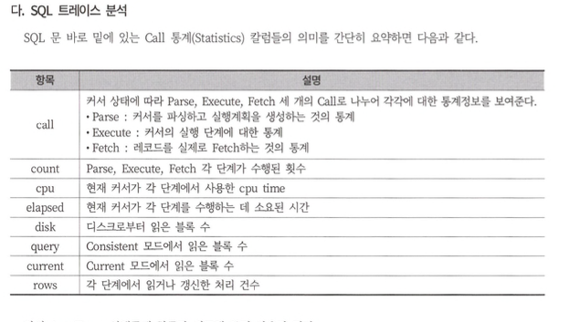

# 2장. SQL  분석도구
# 1절. 예상실행 계획

- 실행 계획 : 사용자의 요청 SQL을 최적으로 수행하고자 DBMS 내부적으로 수립한 처리 절차

### 1. 오라클

- 실행 계획 명령어 : `explain plan for`
- 오라클 10g 이상부터 설치 시, 디폴트로 `sys.plan_table$` 테이블이 생성됨
- `**explain plan` 명령어 수행 →SQL에 대한 실행 계획이 `plan_table`에 저장됨**
- 오라클에서 제공하는 utlxpls.sql 또는 utlxplp.sql 스크립트로 plan_table 확인이 가능.
- 실행 계획 및 실행 통계를 확인하는 명령어 : `**autotrace**`
    
    > ex)
    > 
    > 
    > ```sql
    > set autotrace on
    > #수행할 SQL문
    > select * ~ 
    > ```
    > 
    > - autotrace 명령어 옵션
    >     - SQL 결과 출력
    >         - `set autotrace on`: sql을 수행, 결과와 실행 계획 및 통계를 출력.
    >         - `set autotrace on explain`: sql수행, 그 결과와 실행 계획을 출력.
    >         - `set autotrace on statistics` : sql을 수행, 그결과와 실행 통계를 출력.
    >     - No SQL 결과 출력
    >         - `set autotrace traceonly` : sql 결과 No, Only 실행 계획과 통계만 출력.
    >         - `set autotrace traceonly explain` : no sql 결과, 실행계획만 출력
    >         - `set autotrace traceonly statistics` : no sql, 실행통계만 출력

- 실행 계획 확인 용도는 plan_table이 생성되어있고, 실행 통계까지 함께 확인을 위해선 v_$sesstat, v_$statname, v_$mystat 뷰에 대한 읽기 권한이 필요
- 따라서, **dba, select_catalog_role등의 롤이없는 일반 User에게는 별도 권한 설정이 필요**
- DMBS_XPLAN 패키지
    - 오라클 9.x 버전 이후 부터 지원
    
    ```sql
    select plan_table_output 
    from table(dbms_xplan.display('plan_table', null, 'serial'));
    ```
    
    - `dbms_xplan.display('plan_table', statement_id[or null], 'serial')`
        - statement_id 가 null ? **마지막 explain plan 명령으로 사용된 쿼리의 실행 계획을 보여줌.**
        - `serial` 부분은 format option
            
            

## 2. SQL SERVER

- 실행 계획 명령어 : `set showplan_text on` → *해당 명령어는 쿼리를 실제 실행* 🙅🏻
    
    ex)
    
    ```sql
    use [사용할 디비 카탈로그명]
    go
    
    set showplan_text on 
    go 
    
    select ~ -- 실행할 쿼리  
    go 
    ```
    

- `set showplan_all on` 명령어 실행 시, 상세 실행 계획 조회됨

# 2절. SQL 트레이스

### 1. 오라클

1. **[SQL 트레이스](http://www.gurubee.net/lecture/1842)** 수집 
    - SQL Trace ?
        
        > ***실행되는 SQL문의 실행 계획을 session 별로 모아서 Trace 파일을 생성***
        > 
        > 
        > →  SQL Trace는 세션, 인스턴스 레벨에서 SQL문장 분석이 가능. (extensoin : .TRC)
        > 
        
        ```sql
        alter session set sql_trace = true;
        
        select * from ~ 
        
        alter session set sql_trace = false;
        ```
        
        - TKProf 유틸리티를 사용하면 트레이스 파일을 보기 쉽게 포맷팅
        - UNIX/ DOS 창 내 해당 `TKProf` 명령어 시 help 확인
            
            
<div align="center">
    
</div>     

            
<div align="center">
    
</div>     


### 2. SQL Server

- [프로파일러 tool](https://hotinme35.tistory.com/53)로 인스턴스 level의 추적

# 3절. 응답시간 분석

## 1. 대기 이벤트 (Wait Event)

- 프로세스 간 상호작용에서 wait 상태의 프로세스의 정보

## 2. 응답시간 분석

```sql
응답시간 = service time  + wait time 
       = cpu time + Queue Time 
```

- service time ==  cpu time : 프로세스 정상 동작 수행 시간
- wait time == Queue Time : 프로세스 대기 시간

### AWR

- 응답 시간 분석 방법론을 지원하는 오라클의 표준 도구
- sys 계정 하위 `dba_hist_` 로 시작되는 뷰를 이용
- awr 리포트 분석 시, 인스턴스 효율성은 100%에 수렴할 수록 정상임