# 3장. 인덱스 튜닝 

# 0. 3장 인덱스 튜닝의 목적

- SQL 튜닝의 point는 I/O 효율화에 관점이 있음.
- *I/O 효율화 튜닝을 위해* 옵티마이저 원리를 바탕으로 **`인덱스** 및 조인의 내부 수행원리 이해가 필요`
- 해당 단원에서는 인덱스를 다룬다.

# 1절. 인덱스 기본 원리

- [인덱스란](https://velog.io/@alicesykim95/DB-%EC%9D%B8%EB%8D%B1%EC%8A%A4Index%EB%9E%80) ?
    - 테이블 내, 목차같은 존재로 `데이터베이스 테이블의 검색 속도를 향상 시키기위한 자료구조.`
    - 특정 컬럼에 인덱스를 생성 ⇒ 해당 컬럼들에 해당하는 데이터들을 정렬 ⇒ 별도의 메모리 공간에 데이터의 물리적 주소화 함께 저장됨.
    - 인덱스 생성 시, 오름차순(ASC) 정렬

## 1. 인덱스 구조

### 01. 인덱스 구조 : [B-Tree](https://ko.wikipedia.org/wiki/B_%ED%8A%B8%EB%A6%AC)

<div align="center">
    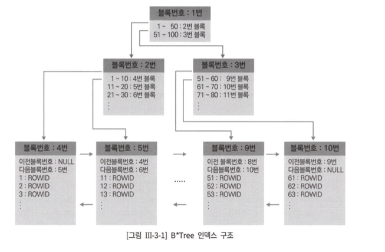
</div>     

- **B-Tree** : 이진트리를 확장하여, 하나의 노드가 가질 수 있는 자식 노드의 수가 2보다 큰 트리형 자료 구조 
(Root→ Branch → Leaf)
- **인덱스의 깊이(Height)**란 ?
    - B-Tree 인덱스 구조에서 Root ↔ Leaf 블록까지의 거리
    - `루트와 브랜치 블록은 하위 노드들에 대한 데이터 값 범위를 나타내고,
     키 값에 대한 블록을 찾는  Key - Address 맵핑 정보를 가짐`
        
<div align="center">
    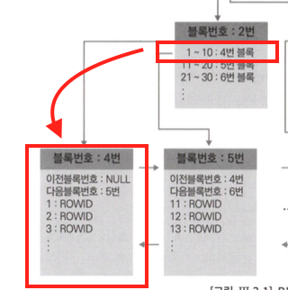
</div>     
        
    - 동일 key값에 대해서는 rowid순으로 정렬
    - `리프 블록`은 항상 인덱스 키 값 순으로 정렬
        - **범위 스캔**이 가능
        - 양방향 (정방향 Ascending, 역방향 descending) 스캔을 지원하는 
        `양방향 연결 리스트 구조로 연결되어 있음`
        

#### RDBMS별 null 값의 인덱스 저장  

1. 오라클 
    - INDEX 구성 컬럼이 모두 null인 레코드는 인덱스 저장 ❌
        - INDEX 구성 컬럼이 하나라도 not null ? 레코드는 인덱스에 저장
2. SQL Server 
    - INDEX 구성 컬럼이 모두 null인 레코드도 인덱스에 저장 ⭕

- 오라클 : SQL Server = NULL 값 맨 **뒤** 저장 : NULL 값 맨 **앞** 저장
`✅ DBMS 별 NULL 값 처리 방식이 상이`

### 02. 인덱스 탐색

- 인덱스의 탐색 과정 : **수직적 탐색과 수평적 탐색**
    
  <div align="center">
    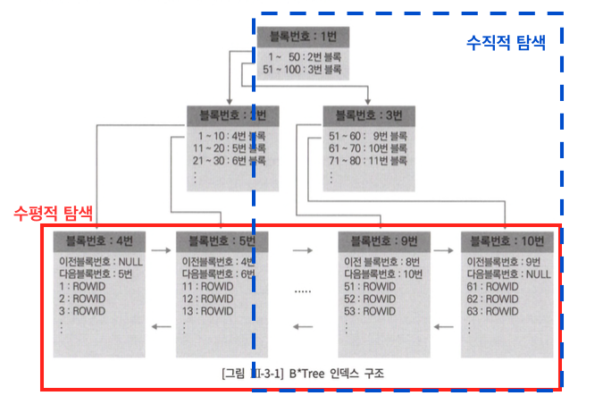
</div>     

    
- **수평적 탐색** : 리프 블록에 저장된 레코드 끼리의 연결된 순서에 따라, 양방향 스캔이 가능
    
<div align="center">
    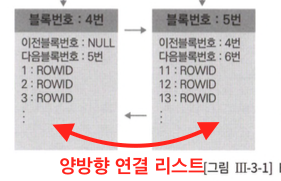
</div>     

- ROWID
    - 오브젝트 번호, 데이터 파일 번호, 블록 번호, 내 위치 정보를 포함

## 2. 다양한 인덱스 스캔 방식

### 01. Index Range Scan

#### ( + Index Range Scan Descending)

- **Index Range Scan**
    
<div align="center">
    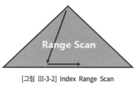
</div>     

    
    - 인덱스 루트 블록 → 리프 블록까지의 수직적 탐색 → 리프 블록 내 필요 범위만 스캔하는 방식
    - B-Tree 인덱스의 일반적 형태의 Access 방식.
    - 오라클 실행 계획 예시
        - `INDEX (RANGE SCAN) OF ‘INDEX_NAME’ (INDEX)`
        
    
    `✅**index range scan 방식에서 성능은 스캔 범위와 테이블 엑세스 횟수의 최소화**가 관건.`
    
- **Index Range Scan Descending**
    - 인덱스를 **뒤**에서 **앞**으로 스캔하여, 내림차순 (DESC)된 결과 집합을 얻는 스캔 방식
        
<div align="center">
    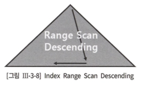
</div>     

    

### 02. Index Full Scan

<div align="center">
    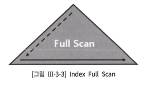
</div>     


- 수직적 탐색 ❌ , **`인덱스 리프 블록을 처음부터 끝까지** **수평적으로 탐색`** 하는 방식
    - ***실제 수행 시, 수직적탐색이 선행됨. Why? 리프 블록을 찾기위해 쩔 수 없음***
- 데이터 검색을 위한 최적의 인덱스가 없는 경우 차선으로 사용 😱😭
- 오라클 기준 실행 계획 예시
    - `INDEX (FULL SCAN) OF ‘INDEX_NAME’ (INDEX)`
- 조회 대상 데이터가 소량일 경우 해당 방식이 유용함

✅ 인덱스의 **데이터 저장 공간**은 `**컬럼 길이 * 레코드 수**`에 의해 결정 

✅ **인덱스를 이용하여 Sort 연산 대체** 

- Index Full Scan은 Index Range Scan과 상동
- 결과 집합이 인덱스 컬럼 순으로 정렬되므로 sort order by 연산을 생략 목적으로 사용될 수 있음
    
    

### 03. Index Unique Scan

<div align="center">
    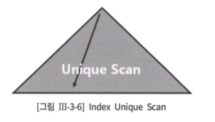
</div>     


- `수직적 탐색으로만 데이터를 스캔하는 방식, 
Unique 인덱스를 등치 조건 (’=’)으로 탐색`
    - ✅ UNIQUE INDEX 일지라도, ***범위검색조건 (BETWEEN, 부등호, LIKE)로 
    검색할때는 IDNEX RANGE SCAN으로 처리된다.***
    
- 오라클 실행 계획 예시
    - `INDEX (UNIQUE SCAN) OF ‘INDEX_NAME’ (INDEX)`

### 03. Index Skip Scan

- 서론
    - **인덱스 선두 컬럼이 조건절로 미 사용 시, 옵티마이저는 Default로 테이블 Full Scan을 선택.**

<div align="center">
    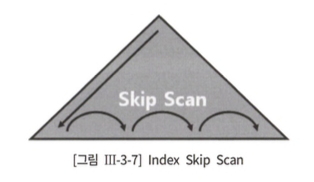
</div>     


- *`**(only 오라클)* 인덱스 선두 컬럼이 조건절에 사용 ❌ 일지라도, 
인덱스를 활용하는 방식`**
- 해당 인덱스 스캔 방식은 인덱스 `선두 컬럼의 Distinct Value 개수가 적고, 
후행 컬럼의 Distinct Value 개수가 많은 경우 유용`

<div align="center">
    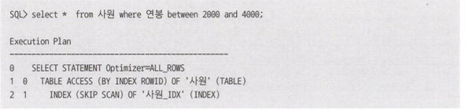
</div>     

- **************Index Skip Scan 내부 수행 원리**************
    - 루트 || 브랜치 블록에서 읽은 컬럼 값 정보를 이용
     → 조건에 부합하는 레코드 포함 가능성이 있는 하위 블록(브랜치 || 리프)만 골라서 엑세스하는 방식

**[Index skip scan 방식보다, 조건절에 있는 in list가 유용한 경우]**

<div align="center">
    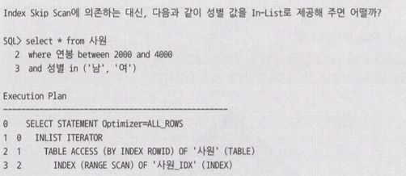
</div>     


### 04. Index Fast Full Scan

- **`인덱스 트리 구조를 무시, 인덱스 세그먼트 전체를 Multiblock Read 방식으로 스캔하는 방식`**
- 속도 : Index Fast Full Scan > Index Full Scan

<div align="center">
    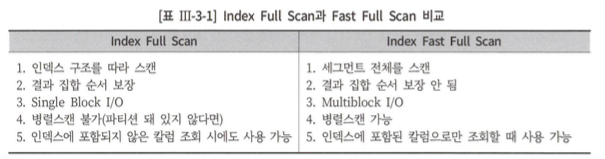
</div>     

---

🔗 참고링크

- [INDEX_SCAN](https://velog.io/@tothek/%EC%9D%B8%EB%8D%B1%EC%8A%A4-%EA%B8%B0%EB%B3%B8-INDEX-SCAN%EC%A2%85%EB%A5%98)

---

## 3. 인덱스 구조  종류

### 01. B*Tree (Balanced : B) 인덱스

- 모든 DBMS가 제공하는 인덱스
- `루트 → 리프 블록까지 어떤 값으로 탐색하더라도,
 read되는 블록 수는 동일함을 의미` 
***⇒ 즉 루트로부터 모든 리프 블록까지의 높이(height)가 동일***
- 추가 제공 인덱스는 B*Tree 인덱스의 단점 보완을 위해 개발됨
- 해당 인덱스 종류에서 발생할  수 있는 **Index Fragmentation**

####  **Index Fragmentation**

1. Unbalanced Index

**[delete작업으로 인해 발생된 불균형 상태의 INDEX]** 
    
<div align="center">
    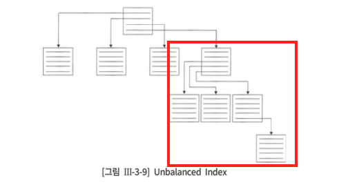
</div>     

    
    - B*Tree 구조에서는 해당 현상은 발생 ❌
    ⇒ 단, Index Skew 또는 Sparse는 index 파편화로 인해, 종종 발생
    
    1. Index Skew
        - 인덱스 엔트리가 한쪽 방향으로 치우쳐진 현상
        
<div align="center">
    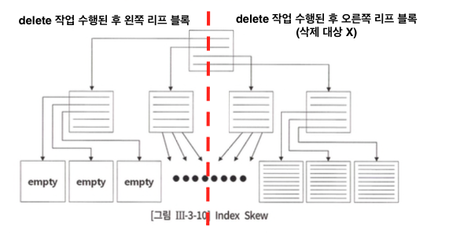
</div>     

        
        - ✅ SQL Server에선 Index Skew 현상이 발생 X
        Why? 주기적으로 B*Tree 인덱스를 체크함으로써 지워진 레코드와 페이지를 정리해 주는 메커니즘을 갖기 때문이다.
    
    1. Index Sparse
        - 인덱스 블록 전반에 걸쳐 밀도가 떨어지는 현상
        
<div align="center">
    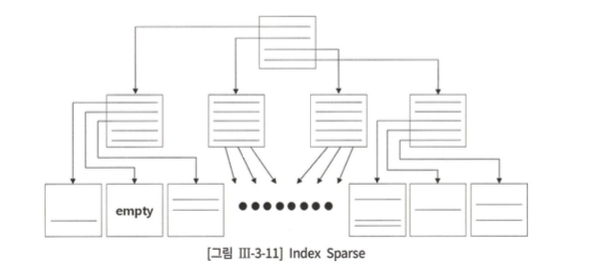
</div>     

        
    - Index Sparse는 지워진 자리에 새로운 값이 입력되지 않으면 영영 재사용되지 않을 수도 있다.
    - 총 레코드 건수가 일정한데도 인덱스 공간 사용량이 계속 커지는 것은 대개 이런 현상에 기인한다.

1. 인덱스 재생성 
    - Fragmentation 때문에 인덱스 크기가 계속 증가하고 스캔 효율이 나빠지면 인덱스를 재생성하거나,  DBMS가제공하는 명령어를 이용해 빈 공간 제거가 유용할 수 있음.
    - ⚠️ 단, 일정 공간을 남겨두고 인덱스를 수행 할 것 ⚠️
    ***⇒ Why? 빈번한 인덱스 분할로 인한 DML 성능 down 👎🏻***
    
<div align="center">
    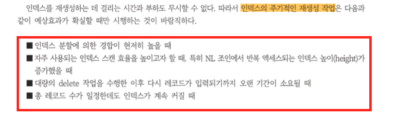
</div>     

    

---

🔗 참고링크 

- [MSSQL 인덱스 재구성 및 조각화 모음](https://ppoble.tistory.com/18)

---

### 02. 비트맵 인덱스

- 오라클은 비트맵 인덱스 구조를 제공

<div align="center">
    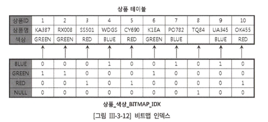
</div>     

- 해당 인덱스 구조는 NULL도 저장한다.
 따라서, `컬럼 is null` 과 같은 조건을 사용할 수 있음
- `Distinct Value 개수가 적을 때, 
비트맵 인덱스를 사용하면 저장효율성에 좋음`

### 03. 함수기반 인덱스

- **F**unction **B**ased **I**ndex (**FBI**)
- ⚠️ 데이터 입력 및 수정 시, 함수를 호출하므로 부하 발생하며 
사용자 정의 함수를 사용할 경우 부하가 더 심함.

### 04. 리버스 키 인덱스

서론 

- **순차적으로 증가되는 값이 존재하는 컬럼에 인덱스 생성 시, 
리프 블록의 한쪽 방향에 데이터가 적재되는 현상이 발생 
(인덱스 파편화의 Indec Skew 현상 참고.)**
- 해당 현상이 발생하는 인덱스
 ⇒ `*Right Growing(또는 Right Hand) 인덱스*`

<div align="center">
    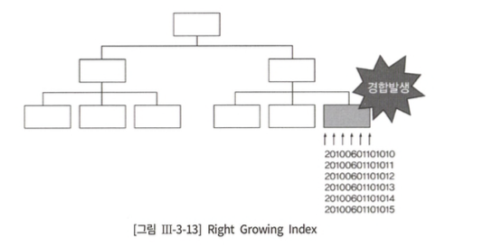
</div>     


정의 

- **입력된 키 값을 역전하여 저장하는 인덱스**
    
    ⇒**`*키 값을 역전하므로 등치(’=’) 조건으로만 검색이 가능*`**
    
- 해당 인덱스 구조로 한쪽 방향에 집중된 트랜잭션을 리프 블록 전체로 분산

<div align="center">
    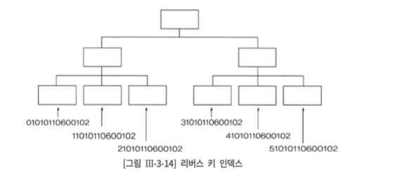
</div>     


- 예시 : `create index 주문_x01 on 주문( reverse(주문일시) );`

### 05. 클러스터 인덱스

- 오라클에는 오브젝트인 **클러스터 테이블**이 존재
- **클러스터 테이블 :** 인덱스 클러스터, 해시 클러스터가 존재
- `클러스터 인덱스 구조는 인덱스 클러스터와 관련이 있음`
- `클러스터 인덱스의 키 값은 항상 유니크를 보장`

<div align="center">
    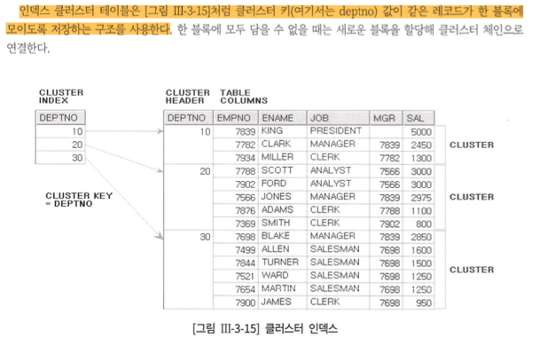
</div>     

### 06. 클러스터형 인덱스와 IOT

- SQL Server에 지원되는 클러스터형 인덱스 유형
    - **Clustered Index**
    - **Non-Clustered Index** **(== B*Tree Index)**

<div align="center">
    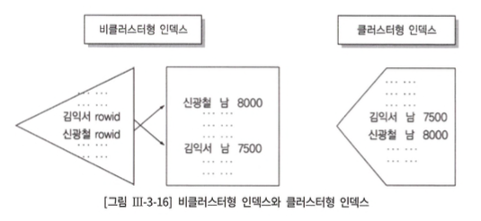
</div>     


- Clustered Index
    - 구조적으로는 B*Tree인덱스와 같으나, 
    별도의 테이블 미 생성 및 모든 row 데이터를 인덱스 리프 페이지에 저장
    - 따라서 ,  **“**인덱스 리프 페이지 == 데이터 페이지**”**
    - ⚠️ 클러스터 형 인덱스 생성시, 정렬 유지 및 빈번한 인덱스 분할로 DML 부하가 야기됨
    - 넓은 범위의 데이터 검색에 유용
    - SQL Server는 클러스터형 인덱스를 가리키는 2차 인덱스를 비클러스터형 인덱스라고 부른다.
    Oracle에선 IOT를 가리키는 2차 인덱스를 ‘Secondaiy Index’라고 부른다.

## 4. 인덱스 튜닝의 기초

### 01. 조건절에 인덱스 선두 컬럼을 사용하였지만,
 범위 스캔 및 인덱스 사용이 불가능한 사례

#### 인덱스 사용 ⭕, 범위 스캔 ❌

- 인덱스 full 스캔은 가능

```sql
select *
from 업체
where substr(업체명, 1, 2) = '대한‘
```

```sql

select *
from 고객
where 직업 <>‘학생’
```

```sql
select *
from 사원
where 부서코드 is not null
```

- 부정형 비교 및 문자 분할

### 02. 인덱스 컬럼 가공 튜닝 사례

<div align="center">
    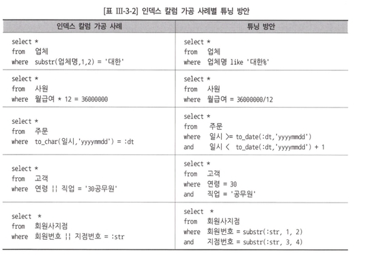
</div>     


### 03. 묵시적 형변환

- 인덱스 컬럼을 사용자가 명시적으로 가공하지않았어도 
`***조건절에서 비교되는 두 값의 데이터 타입이 다를 경우 내부적인 형변환이 발생됨***`

# 2절. 테이블 엑세스 최소화

- 쿼리시, 참조되는 컬럼이 인덱스에 모두 포함되지 않는한 `테이블 랜덤 엑세스` 발생

## 1. 인덱스 ROWID에 의한 테이블 랜덤 액세스

### 01.  인덱스 ROWID에 의한 테이블 엑세스 구조

- rowid가 메모리 상의 위치정보가 아니라 디스크 상의 위치정보

### 02. 클러스터링 팩터

- 오라클만 공식적인 용어로 지칭해서 사용되는 개념
- 해당 개념을 사용하여, RowID에 의한, 테이블 엑세스 cost를 평가.
- **클러스터링 팩터 ?**
    - **`특정 컬럼을 기준으로 같은 값을 갖는 데이터의** **군집성 계수 (= 데이터의 군집 정도)를 의미.**`
    
    **[클러스터링 팩터가 Good vs Bad 도식화 예시]**
    
<div align="center">
    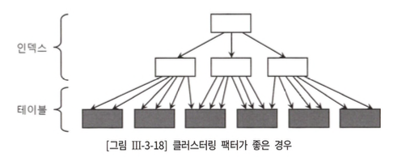
</div>     

<div align="center">
    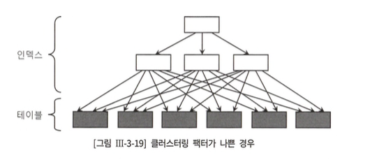
</div>     

    

### 03. 인덱스 손익분기점과 인덱스 손익 분기점 극복

- ***인덱스 손익분기점***이란?
    - ***속도 측면 index range scan 테이블 엑세스 ≤ 테이블 full scan인 지점***
- 인덱스 손익분기점
    - 일반적으로, 5~20%의 수준으로 결정됨
    - 단, 클러스터링 팩터에 큰 영향을 받음
        - 클러스터링 팩터가 나쁠 경우 : 좋은 경우  = 5% 미만 결정 : 90%까지도 오름
- 손익분기점 극복 방안
    1. **테이블 자체를 인덱스 구조로 생성** 
    → 테이블이 항상 정렬 상태를 유지, `인덱스 리프 블록 == 데이터 블록`으로 추가적 랜덤 엑세스가 불필요 (rowid에 의한 테이블 엑세스가 랜덤 엑세스임.)
    2. **SQL Server의 Include Index 기능 사용** 
        - 인덱스 키 외, 사전 지정된 컬럼을 리프 레벨에 함께 저장하는 기능
        - 테이블 엑세스 횟수를 최소화하는 역할을 줌
    3. **오라클에서 제공되는 클러스터 테이블** 
        - 클러스터에 도달할 시, 시퀀셜 방식으로 스캔하므로 효율적
    4. **파티셔닝** 
        - 대량 범위 검색 조건으로 테이블 파티셔닝 시, full 스캔시에도 일부 파티션만 읽고 멈출 수 있음

## 2. 테이블 엑세스 최소화 튜닝

### 01. 인덱스 칼럼 추가

### 02. Covered Index

- 테이블 엑세스 미 발생을 위한 모든 컬럼을 인덱스에 포함하는 방법을 고려
- 해당 방법을 고려한 인덱스를 SQL Server에서 일컬지는 용어
(인덱스만 읽고 처리하는 쿼리 : Converd 쿼리)

### 03. Include Index

- SQL Server에만 지원되는 기능
- **`인덱스 키 외 사전 지정한 컬럼을 리프 레벨과 함께 저장하는 기능`**
- 예시
    - `create index emp_x01 on emp (deptno) include (sal)`
        
        → 컬럼은 최대 1023개 지정가능
        

### 04. IOT, 클러스터형 인덱스, 클러스터 테이블 활용

### 05. 수동으로 클러스터링 팩터 높이기

- 클러스터링 팩터가 나쁜 인덱스를 기준으로 테이블 재생성함으로 인위적인 클러스터링 팩터 효율을 올림

### 06. 배치 I/O

# 3절. 인덱스 스캔 효율화

> 인덱스 스캔 시, 발생되는 비효율적 원인 및 튜닝 기법을 설명
> 
> 
> 복습]
> 
> - DB I/O 시, 접근 방식
>     - 랜덤 엑세스 : 레코드 간의 순서가 없이, 건 by one block으로 접근하는 방식
>     - 시퀀셜 액세스 : 레코드간 논리적 || 물리적 순서에 따라, 순차적으로 접근하는 방식
> 
> 목표]
> 
> - 시퀀셜 엑세스에 의한 선택 비중을 높이고, 해당 방식의 스캔 단계 비효율성을 해소하는 원리를 학습

---

## 1. 인덱스 선행 컬럼이 범위조건일 때의 비효율

- 인덱스 구성 컬럼이 조건절 내 등치 조건이면, 인덱스 스캔 효율은 최상
- 인덱스 선행 컬럼을 조건절에 누락 || 범위 검색 조건 사용시 인덱스 스캔 단계 비효율 발생
- 조건 절에 범위 검색 조건을 사용하더라도, 선행 컬럼이 등치 조건이면 효율 Not Bad

## 2. 범위조건을 In-List로 전환

- 인덱스 구성 변경이 어려운 운영환경에서 between → In-List로 바꿔 사용하자
- 단, In-List 개수가 많으면 안돼!

## 3. 범위조건을 2개 이상 사용할 때의 비효율

- 1st 인덱스 컬럼이 인덱스 스캔 범위를 거의 결정하고, 2st부터 필터 조건 역할만 수행되는 경우가 있음