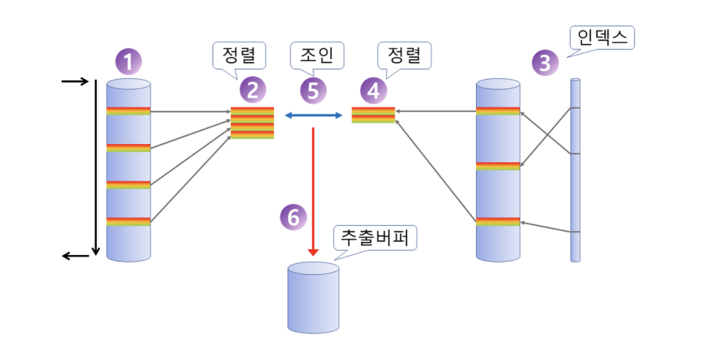
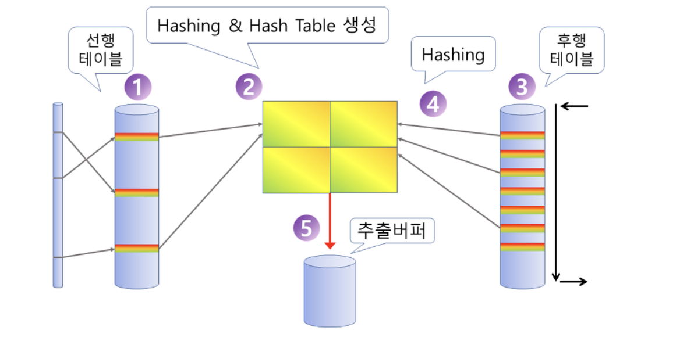

# 4장. 조인 튜닝

## 제1절 NL 조인 (NESTED LOOP)

[참고사항] 중첩 루프 조인](https://coding-factory.tistory.com/756)

### NL 조인의 특징

- 대부분의 DBMS 블록 단위 I/O를 수행 (랜덤엑세스 방식)  → *NL 조인은 주로 랜덤 엑세스 조인 방식*
    - 따라서, 대량의 데이터 조인 시, 효율 📉
- 조인을 한 레코드씩 순차적인 진행
    - 대용량 데이터 처리 시, 효율 🔽
    - but, 부분 범위 처리가 가능한 상황에서는 응답 속도가 빠름
    - Driving Table의 처리 범위에 따라 전체 일량이 결정됨

 ⇒ Index 구성 전략이 중요 (`조인 컬럼을 선두로 갖는 인덱스의 존재 유무가 매우 중요`)

- 정렬 / 해시 테이블 생성과 같은 대기(wait)하는 선행 작업이 없어 추가 메모리 사용 🙅🏻‍♂️
    - ⇒ 메모리 사용량은 적네.
- Driven Table의 조인 컬럼 인덱스 존재 유무에 따라 성능 영향 📈
    - Driven Table 에 인덱스가 미 설정된 경우 Driving Table에서 도출된 결과와 맞는지 Full Scan함..
    - 따라서, Driven Table 인덱스 생성이 어려운 경우 다른 조인 튜닝으로 변경할 것을 권장
     (ex. 소트 머지 조인 / 해시 조인 등)

- **소량의 데이터 처리, 부분 범위 처리가  가능한 OLTP에 적합한 조인 방식**

## 제 2절 소트 머지 조인

두 테이블을 각각 정렬 → 두 집합을 Merge 하면서 조인을 수행하는 방식

- 소트 머지 조인의 동작
    1. Sort 단계 : 양쪽 집합을 조인 컬럼 기준으로 정렬  (`조인 컬럼에 인덱스가 있는 경우 **Sort 단계** 생략`)
    2. Merge 단계 : 정렬된 양쪽 집합을 서로 Merge

- DBMS 종류 별 소트 머지 조인 처리
    - SQL Server는 조인 연산자가 ‘=’인 경우만 가능
    - 오라클은 부등호 or 조인 조건이 없어도 처리 가능

---

**[소트 머지 조인 수행 과정]**

    

     

[참고] 조인 튜닝](https://hoon93.tistory.com/46) , [오라클 조인 튜닝](https://hyeyul-k.tistory.com/15)

- 선행 테이블에서 조건을 만족하는 행을 탐색
- 해당 행을 선행 테이블 조인 컬럼 기준으로 데이터 정렬
- 후행 테이블에서 조건을 만족하는 행을 탐색
- 해당 행들에 대해 후행 테이블의 조인 컬럼을 기준으로 데이터 정렬
- 양쪽 테이블을 조인
- 조인에 성공하면 추출 버퍼에 삽입

---

### 소트 머지 조인의 특징

- 조인 전, 양쪽 테이블을 정렬 (조인 컬럼 기준으로 정렬을 수행)
- 부분적 부분 범위 처리가 가능
- 테이블 별 검색 조건에 의해 전체 일량이 좌우됨
- 스캔 위주의 조인 방식
    - merge 과정에서 랜덤 엑세스가 발생되지 않음
    - 단, 정렬 대상 레코드  탐색은 랜덤 엑세스가 발생
- 정렬 대상 데이터가 많은 경우 성능 저하
    - 대량 조인 작업은 CPU 작업 위주의 해시 조인이 유리

- 해시 조인보다 유리한 상황
    - 선행 테이블에 Sort연산을 대체할 인덱스가 있는 경우
    - 조인할 선행 테이블이 이미 정렬된 경우
    - 조인 조건이 등치 (’=’)일 경우

- **조인 컬럼에 인덱스가 없거나, 출력할 결과 값이 많을 경우에 적합한 조인 방식**

## 제3절 해시 조인

---

**[해시 조인 수행 과정]**

    

     

- 선행 테이블에서 조건을 만족하는 행 탐색
- 조회된 행 들에대해서, 선행 테이블의 조인 컬럼을 기준으로 해시 함수를 적용 ⇒ 해시 테이블을 생성
- 후행 테이블에서 조건을 만족하는 행 탐색
- 해당 행들에 대해서, 후행 테이블에 해시 함수를 적용해서 선행 테이블의 해시 테이블에 맞는 버킷을 탐색
- 조인 수행 성공 시, 추출 버퍼에 삽입
- 후행 테이블 조건을 만족하는 모든 행 들에 대해 3- 5번 반복

---

- 해시 테이블 생성 비용이 수반되나, NL 조인의 랜덤 엑세스 부하 X, 소트 머지 조인처럼 사전 정렬 부담 X
- **Build Input**
    - 선행 테이블을 의미, 선행 테이블로 해시 테이블을 생성하기 때문에 해시 조인에서 일컬여짐
- **Prove Input**
    - 후행 테이블을 의미, 생성된 해시테이블 기반 해시 값 존재 여부를 체크하므로 일컬여짐

- 해시 조인은 선행 테이블(**Build Input**)이 작을수록 효과적

## 제4절 스칼라 서브 쿼리

한 레코드 당 하나의 값만을 리턴하는 서브 쿼리

### 스칼라 서브 쿼리의 캐싱 효과와 특성

- 스칼라 서브 쿼리 사용시, 내부적으로 캐시를 생성
    - 서브 쿼리에 대한 I/O 값을 저장
    - 메인 쿼리로 동일 입력값이 들어오면, 캐시된 출력 값 리턴
    - 캐시에서 탐색 불가 시, 쿼리 수행
- 스칼라 서브 쿼리 수행 시, 해싱 알고리즘 사용 ⇒ 대용량일 경우 CPU 성능 저하

## 제5절 고급 조인 기법

### 1. 인라인 뷰 활용

- 인라인 뷰 : 서브 쿼리가 FROM 절 안에서 사용되는 경우

### 2. 배타적 관계의 조인

- 상호 배타적 관계
    - 어떤 엔티티가 두 개 이상의 다른 엔티티와 합집합과 관계를 갖는 것

### 3. 부등호 조인

### 4. Between 조인

- Tmi
    - 점 이력 :   시작 지점만 관리하는 것
    - 선분 이력 :   시작 및 종료 시점을 함께 관리하는 것

### 5. ROWID 활용

- 점이력
    - 데이터 변경이 발생할 때마다 변경일자와 함께 새로운 이력 레코드를 쌓는 방식