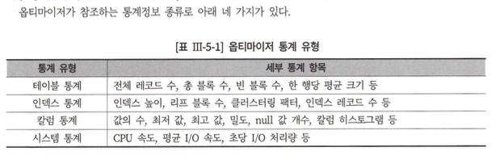
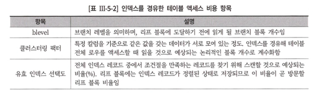
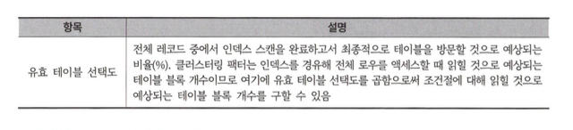

# 5장. SQL 옵티마이저

## 제1절 SQL 옵티마이징 원리

### 가. 옵티마이저 종류

1. 규칙기반 옵티마이저 
    - 규칙 : 엑세스 경로별 우선순위
        - 인덱스 구조, 연산자, 조건벌 형태가 순위 결정 주요
2. 비용기반 옵티마이저 (CBO : Cost-Based Optimizer)
    - 비용 (: 쿼리를 수행하는데 소요되는 시간) 기반의 최적화 수행

### 나. 최적화 목표

1. 전체 처리 속도 최적화
    - 쿼리 최종 결과 집합을 끝까지 읽는 것
    - `시스템 자원 (I/O, CPU, 메모리 등)을 최소화 하는 실행 계획`을 선택.
    - 대부분 DBMS 기본 옵티마이저 모드는 전체 처리 속도 최적화에 설정되어있음
2. 최초 응답 속도 최적화 
    - 전체 결과 집합 중 일부만 읽다가 멈추는 것을 전제로 함.
    - `가장 빠른 응답 속도를 반환하는 실행 계획` 을 선택함
    - `최초 응답 속도 최적화` 요구하려면 ?
        - 오라클
            - 옵티마이저 모드 : first_rows로 변경한다.
        - SQL Server
            - 테이블 힌트 fastfirstrow를 지정

### 옵티마이저 행동에 영향을 미치는 요소

1. SQL과 연산자 형태 
2. 옵티마이저 팩터 
    1. 인덱스, IOT, 클러스터링, 파티셔닝 등의 구성 방식 
3. DBMS 제약 설정 
    
    ex) Not null 제약조건 설정 → 전체 개수를 구하는 Count 쿼리에 활용 
    
4. 옵티마이저 힌트 
5. 통계정보 
6. 옵티마이저 관련 파라미터 (버전업하란소리..)
7. DBMS 버전과 종류

### 옵티마이저의 한계

- 통계 정보의 부정확성
    - 테이블 컬럼 분포가 고르지않은경우 컬럼 히스토그램이 반드시 필요 
    → 해당 데이터 수집 및 유지 비용이 📈
- 바인드 변수 사용 시 균등 분포 가정
- 규칙에 의존하는 CBO
    - 비용기반 옵티마이저도 부분적인 규칙에 의존
- HW 성능 특성에 따라감

### 통계정보를 이용한 비용 계산 원리

- DBMS 버전이 올라갈수록 자동 통계 관리 방식이나, 간혹 DBA가 수동으로 수집 및 관리해야 함
    
<div align="center">
    
</div>     

- 클러스터링 팩터
    - 인덱스 정렬 순서와 테이블 정렬 순서가 서로 비슷할 수록 좋음

- **선택도 (Selectivity)**
    - 전체 대상 레코드 중 특정 조건에 의해 선택될 예상 레코드 비율
    - 최적의 실행 계획 수립을 위한 중요 요인
        
        ✅ **`선택도 → 카디널리티 → 비용 → 엑세스 방식, 조인순서 및 방법 등 결정`** ✅
        
    - 히스토그램 존재 시, 히스토그램으로 선택도를 산정
    - 조건절 바인드 변수 사용 시→ 데이터 분포가 균일로 가정 후 선택도 산정
        - 히스토그램 없이 등치 조건 (=) 에 대한 선택도 계산 방법
            
            ```
            선택도 = 1 / (distinct vlaue 개수) = 1/(num_distinct)
            ```
            

- **카디널리티 (Cardinality)**
    - `특정 엑세스 단계 후 출력이 예상되는 결과 건 수를 의미.`
    - 카디널리티 = 총 ROW 수 * 선택도

- **히스토그램**
    - 도수분포 히스토그램
    - 높이균형 히스토그램

- 비용
    - 옵티마이저의 비용 모델
        - I/O 비용 모델  : 예상되는 I/O Call 횟수만 쿼리 수행 비용으로 산정
        - CPU 비용 모델  : I/O Call 횟수뿐만 아닌 시간까지 포함한 비용 산정

- 1) **I/O 비용 모델 : `인덱스를 경유한 테이블 엑세스 비용`**
    - 비용은 논리 | 물리적으로 읽은 블록 개수 X ⇒ I/O Call 횟수를 의미
    - `인덱스 경유한 테이블 액세스 시 Single Block I/O` 방식 사용
    *→ 물리적 Read 블록 개수 == I/O Call 개수*
    - 비용
        
        > = blevel                                                    #인덱스 수직적 탐색 비용
        > 
        > 
        >  + (리프 블록수 * 유효 인덱스 선택도)        #인덱스 수평적 탐색 비용 
        >  + (클러스터링 팩터 * 유효 테이블 선택도)  #테이블 랜덤 액세스 비용 
        > 
        
          
<div align="center">
    
</div>     

            
<div align="center">
    
</div>     

- 2) **I/O 비용 모델 : `Full Sacn에 의한 테이블 엑세스 비용`**
    - 1:n = I/O Call : 디스크 블록 ⇒ Multiblock I/O 방식 사용
    - `I/O Call 개수 = (총 블록 수) / (Multiblock I/O 단위)`

## 제2절 SQL 공유 및 재사용

### 소프트 파싱 vs 하드 파싱

- 시스템 공유 메모리에서 SQL과 실행 계획이 캐싱되는 영역
    - 오라클 : 라이브러리 캐시
    - SQL Server : 프로시저 캐시

#### 소프트 파싱 : SQL과 실행계획을 찾아 실행단계로 넘어가는 방식 

#### 하드 파싱  : SQL과 실행계획을 찾지 못해 최적화 과정을 거치고 실행단계로 넘어가는 경우를 말함

- 라이브 러리 캐시
    - 해시 구조로 관리됨
    - 따라서, SQL마다 해시 값에 따라 여러 해시 버킷으로 나누어 저장됨
    - `SQL 탐색 : 쿼리를 해시 함수에 입력 → 반환된 해시 값을 토대로 해당 해시 버킷을 탐색`

### SQL 공유 및 재사용의 필요성

### 실행 계획 공유 조건

SQL 수행 절차를 정리해 보면 다음과 같다.

> 1 문법적 오류와 의미 상 오류가 없는지 검사한다.
2 해시 함수로부터 반환된 해시 값으로 라이브러리 캐시 내 해시버킷을 찾아간다.
3 찾아간 해시버킷에 체인으로 연결된 엔트리를 차례로 스캔하면서 같은 SQL 문장을 찾는다.
4 SQL 문장을 찾으면 함께 저장된 실행계획을 가지고 바로 실행한다.
5 찾아간 해시버킷에서 SQL 문장을 찾지 못하면 최적화를 수행한다.
6 최적화를 거친 SQL과 실행계획을 방금 탐색한 해시버킷 체인에 연결한다.
7 방금 최적화한 실행계획을 가지고 실행한다.
> 

### 실행 계획을 공유하지 못하는 경우

- 아래 항목들에 대해 별도의 실행계획을 수립한다.
    1. 공백 문자 또는 줄바꿈 
    2. 대소문자구분
    3. 주석
    4. 테이블 Onwer 명시 
    5. 옵티마이저 힌트 사용 
    6. `[조건절 비교값 **(라이브러리 캐시 효율과 연관.)**](https://www.notion.so/5-SQL-b937eb9644d74b24ac16bebcd16bbf6a?pvs=21)`

### 바인드 변수 사용

- **리터럴 변수**란 ?
    - Where절에 컬럼과 비교되는 값이 상수 값으로 직접 선언된 경우의 변수
    - `SELECT * FROM TABLE01 WHERE COL01 = "TEST";`
- **바인드 변수**의 중요성
    
    > **************************바인드 변수**************************
    > 
    > - Where절 컬럼과 비교되는 값이 바인드 변수 형태로 사용하는 경우의 변수
    > - 바인드 변수 위치에 param 으로 넘어온 값이 대체됨
- 바인드 변수 사용 시, 하나의 프로시저를 공유 → 재사용성 보장

**[바인드 변수 사용시, 특징]**

- 하드 파싱 과정을 통한 실행 계획 생성
- 해당 실행계획을 라이브러리 캐시를 통해 동일 SQL을 사용하는 Session들간 반복 재사용을 보장
- SQL과 실행계획을 재사용함으로 파싱 소요시간 및 메모리 사용량을 🔽
    - 동시 접속자가 많은 경우 더 좋음
    - OLTP환경에서는 권고
- 주의 사항
    - 컬럼 분포가 불균일할 경우 실행시점에 바인딩되는 값에 따라 쿼리 성능이 상이.

---

[용어]

- Parse Call:  SQL 문장을 캐시에서 찾으려고 시도한 횟수
- Pro*C : 오라클 데이터베이스와 연동할 수 있는 C 프로그램입니다

---

### 애플리케이션 커서 캐싱

묵시적 캐싱 옵션 

Java의 `setImplicitCachingEnabled` 메서드와 동일한 기능을 수행하는 C#의 메서드는 없음.

```java
public static void CursorCaching(Connection conn, int count) throws Exception! 

// 캐시 사이즈를 1로 지정
((OracleConnection)conn).setStatementCacheSize(1); 

// 묵시적 캐싱 기능을 활성화
((OracleConnection)conn).setlmplicitCachingEnabled(true);

	for(inti=1; i<=count; i++){
		// PreparedStatement를 루프문 안쪽에 선언 PreparedStatement stmt = conn.preparestatement(
		SELECT ?,?,?,a.* FROM emp a WHERE a.ename LIKE 'W%'"); stmt.setlnt(1,i);
		stmt.setlnt(2,i);
		stmt.setString(3z"test"); ResultSet rs=stmt.executeQuery();
		rs.closeO;
		// 커서를 닫더라도 묵시적 캐싱 기능을 활성화 했으므로 닫지 않고 캐시에 보관하게 됨
		stmt.close( );
	}
}
```       

### Static SQL vs Dynamic SQL

https://ipajama.tistory.com/133

## 제3절 쿼리 변환

### 쿼리 변환

- 옵티마이저가 SQL을 분석해 의미적으로 동일하며 더 나은 성능 형태로 재작성하는 것

#### 쿼리 변환 종류

- 휴리스틱 쿼리 변환
    - 규칙기반의 쿼리 변환
    - 결과 보장시, 무조건 쿼리 변환 수행
- 비용기반 쿼리 변환
    - 변환된 쿼리의 비용이 낮을 경우 사용

### 서브쿼리 Unnesting

- “중첩 서브쿼리를 풀어냄”으로 서브쿼리와 메인쿼리를 동일 레벨로 만듬
    
    ***⇒ 동일한 결과를 보징하는 조인문으로 변환하고 나서 최적화***
    
- 해당 과정을 통해, 엑세스 경로와 조인 메서드를 평가

---

용어]

UNNEST : SQL에서 배열이나 다차원 배열을 풀어서 테이블 형태로 반환하는 함수

 세미조인 :  서브쿼리를 사용했을 때 메인쿼리와의 연결을 처리를 의미

---

### 뷰 Merging

- 옵티마이저는 쿼리블록을 풀어내려고 함
- 따라서, 액세스 쿼리 블록(**뷰를 참조하는 쿼리 블록**)과 뷰 쿼리 블록의 머지 과정을 거침
- 뷰 머징 과정시, 비효율적인 경우
    - group by
    - select-list에 distinct 연산자 포함

### 조건절 Pushing

- ✅ 옵티마이저가 뷰를 처리하는 방법 중 하나 (1차적으로 뷰 Merging 고려)
- 조건절 Pushing 이란 ?
    - `뷰를 참조하는 쿼리 블록의 조건절을 뷰 쿼리 블록 내에 넣는 기능`

### 조건절 이행

- 추론 과정을 통한 새로운 조건절을 내부적으로 생성해주는 쿼리 변환

### 불필요한 조인 제거

- 1:M 관계의 테이블 조인 시, M쪽의 테이블만 읽도록 쿼리를 변환하는 것
    
    ⇒ `테이블 제거 or 조인 제거` 라 한다.
    

### OR 조건을 Union으로 변환

- OR-Expansion 쿼리변환
    - or 조건에 대한 full table scan 처리 대신 union all 형태로 변환

### 기타 쿼리 변환

#### 집합연산을 조인으로 변환 

####  조인 컬럼에 is not null 조건 추가

####  필터 조건 추가 

####  조건절 비교 순서