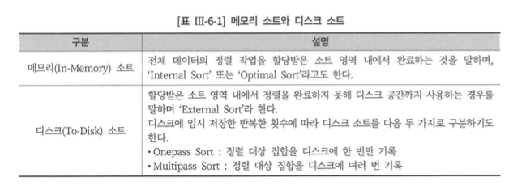
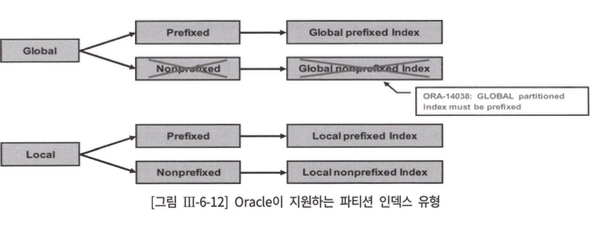

# 6장. 고급 SQL 튜닝

## 제1절 소트 튜닝

- sort 연산 발생 시, DBMS는 정해진 메모리 공간에 Sort영역을 할당 및 정렬을 수행.
- 소트영역
    - 오라클 : PGA, SqlServer : 버퍼 캐시
- 메모리 공간이 부족한 경우 디스크를 사용
    - 오라클 : Temp TableSpace, SqlServer : tempdb
    

<div align="center">
    
</div>     

### 소트를 발생 시키는 연산

1. Sort Aggregate : 전체 row를 대상으로 집계를 수행하는 경우 
    
    ```sql
    select sum(sal)z max(sal)z min(sal) from emp
    ```
    
2. Sort Order By : 정렬된 결과 집합을 얻는 경우 
3. Sort Group By : Sorting 알고리즘을 사용해 그룹별 집계를 수행하는 경우
    
    ```sql
    select deptno, job, sum(sal), max(sal), min(sal)
    from emp 
    group by deptno, job
    ```
    
4. Sort Unique : 결과 집합에서 중복 레코드를 제거하는 경우 (ex. Union | Distinct 연산자 사용시)
5. Sort Join : 소트 머지 조인을 수행하는 경우
6. Window Sort : 윈도우 함수 수행하는 경우 
    
    ```sql
    select empno, ename, job, row_number() over (order by hiredate)
    from emp
    ```
    

### 소트 튜닝의 방안

### 데이터 모델 측면에서의 검토

정규화를 잘하자…!

### 소트가 발생하지 않도록 SQL 작성

1. Union → Union All 로 대체 
    
    > Union은 중복 제거를 위해 sort unique 연산 수행
    > 
2. Distinct → Exists 서브 쿼리로 대체 
3. 불필요한 Count 연산 제거 

### 인덱스를 이용한 소트연산 대체

인덱스의 키 컬럼 순 정렬을 이용하자..!

1. Sort Order By와 Sort  Group By대체 
2. 인덱스를 활용한 Min, Max 계산 

### 소트 영역을 적게 사용하도록 SQL 작성

소트연산이 불가피하다면 가능한 메모리 내에서 처리한다.

- `인라인 뷰 서브 쿼리를 사용해서 미 가공된 상태를 정렬 후 메인 쿼리에서 가공한다.`
- Top N 쿼리의 활용
    
    → 처음 읽은 레코드 부터 N만큼 정렬상태로 배열에 담음 
    
    → Top N Sort 알고리즘
    
    - 윈도우 함수에서의 Top N 쿼리 [Top N Sort 알고리즘이 적용된 예시]
        
        ```sql
        select 고객ID, 변경순번, 전화번호, 주소, 자녀수, 직업, 고객등급
        from 
        (
        	select 고객ID, 변경순번
        				, rank() over (partition by 고객ID order by 변경순번) rnum
        				, 전화번호, 주소, 자녀수, 직업, 고객등급
        	from 고객변경이력
        )
        where rnum = 1
        ;
        ```
        

### 소트 영역 크기 조정

- 오라클에서만 제공되는 소트영역 수동 조정
- 기본적으로 자동 PGA 메모리 관리 방식이 활성화되지만, 시스템 | 세션 레벨에서 수동 PGA 메모리 관리 방식으로 전환할 수 있다.

자동 PGA 메모리 관리 방식 

- 프로세스 당 사용할 수 있는 소트 영역의 최대 크기를 제한
    
    ```sql
    alter session set workarea_size_policy = manual; 
    alter session set sort_area_size = [설정할 사이즈];
    ```
    

## 제2절 DML 튜닝

### Insert 튜닝

- Direct Path Insert
    - Heap 의 FreeList를 패스한 HWM 바깥 영역, 데이터 파일에 바로 입력하는 방식
    - 대량의 데이터를 한번에 입력 ( Bulk Insert ) 시, 유용
        1. insert select 문장에 힌트 사용 ( `/*+ append */`)
        2. 병렬모드로 Insert (`Parallel 힌트`)
        3. Direct 옵션 지정과 sqlldr로 데이터 로드
        4. CTAS(create table ... as select) 문장을 수행

1. 오라클 
    1. nologging 모드 insert 
        
        > 테이블 속성을 nologging으로 변경 → Redo 로그 최소화
        > 
        > 
        > `alter table t NOLOGGING;` 
        > 
2. Sql Server 
    1. 최소 로깅
        
        
        1. 데이터 복구모델을  Bulk-logged | SIMPLE 로 설정 (단, SIMPLE 모드는 트랜잭션 로그 백업 불가.. Bulk-logged는 백업 끝점으로 복구 가능하나, 지정 시간 복구 X) 

⚠️ Direct Path Insert ⚠️

---

해당 방식 사용 시, 트랜잭션이 빈번한 곳에서 해당 옵션을 사용하면 insert작업 동안 다른 트랜잭션이 해당테이블DML 수행이 불가함 

---

### Update 튜닝

- Truncate & Insert 방식 사용
- 조인을 내포한 업데이트 튜닝 (Update Join)
    
    ```sql
    -- 여러 테이블 간의 조인 가능 
    UPDATE [변경될테이블] 
    SET [컬럼1] = A2.[컬럼1] 
    	, [컬럼2] = A2.[컬럼2] 
    FROM  [조인테이블] A2    
    WHERE [변경될테이블].[조건컬럼] = A2.[조건컬럼]
    ;
    ```
    
    - 오라클에서는 Updatable Join View를 활용
- Merge문을 활용하자!

## 제3절 데이터베이스 Call 최소화

### 데이터 베이스 Call 종류

1. SQL 커서에 대한 작업 요청에 따른 분류 
    1. Parse Call : Sql 파싱을 요청하는 Call 
    2. Execute Call : Sql 실행을 요청하는 Call 
    3. Fetch Call : 조회 쿼리 결과를 전송 요청하는 Call 
2. Call 발생 위치에 따른 구분 
    1. User Call 
        
        > 동시 접속사 수가 많은 Peek 시간 대 시스템 확장성의 저하를 야기
        > 
    2. Recursive Call 
        
        > User Call과 달리, DBMS 내부에서 발생하는 Call을 의미.
        바인드 변수를 사용해서 하드 파싱의 빈도를 최소화
        > 

### Fetch Call 최소화

- 부분범위 처리의 원리
    - DBMS가 데이터를 Client에 전송 시, 전송 단위를 설정하여 단위만큼씩 전송
    - ArraySize 조정에 의한 Fetch Call 감소 및 블록 I/O 감소 효과

### 사용자 정의 함수 & 프로시저의 특징과 성능

1. 특징 
    - 내장함수와 달리, 완전한 컴파일 형태가 아님,
    - 가상 머신같은 별도의 실행엔진을 통해 실행됨
2. 성능 
    - 여러 유형의 DB Call을 발생하여 성능 저하를 야기
    - 따라서, 소량 데이터 | 부분범위 처리가 가능한 상황에서 사용 권장

## 제4절 파티셔닝

### 1. 개요

- 테이블 or 인덱스 데이터를 파티션 단위로 나누어 저장하는 것
- 파티셔닝 시, 파티션 키에 따라 물리적으로 별도의 세그먼트에 데이터를 저장

### 2. 필요성

- 성능 측면
    
    > 테이블을 파티션 단위로 분할 관리되어, Full Scan시에도 일부 세그먼트만 조회하는 이점 존재
    > 
- 관리 측면
    
    > 데이터 백업 시, 파티션 기능으로 시간을 단축 (파티션 단위 백업)
    > 

### 3. 파티션 유형

(oracle)

1. Range 파티셔닝 
    - 파티션 키 값 범위로 분할
    - 가장 기본적인 형태이며, 주로 날짜 컬럼을 기준으로 분할 (ex. 판매데이터의 월별 분할)
2. Hash 파티셔닝
    - 파티션 키 값에 해시함수를 적용 → 반환 된 값으로 파티션 매핑
    - 데이터가 파티션에  분산 되도록 DBMS가 관리 (따라서, 각 row 저장위치 예측이 불가)
    - 파티션 키 데이터 분포가 고른 컬럼이 유리
    - 병렬처리 시 유리
    - DML 경합 분산에 효과적
3. List 파티셔닝 
    - 불연속적 값 목록을 각 파티션에 지정
    - 사용자가 정한 기준에 따라 테이블을 분할 저장
        
        (ex. 판매 데이터 지역 별 분할)
        
4. Composite 파티셔닝 
    - 1 ~ 3 파티션을 복합
    - Range || List 파티션 내 다른 서브 파티션을 구성

### 파티션 Pruning

옵티마이저가 SQL 대상 테이블과 조건절을 분석해 불필요한 파티션을 엑세스 대상에서 제외하는 기능 

1. 유형 
    1. 정적 Pruning 
        - 엑세스할 파티션 컴파일 시점을 미리 결정
        - 파티션 키 컬럼을 상수 조건으로 조회 시 작동
        
    2. 동적 Pruning 
        - 엑세스할 파티션을 실행 시점에 결정
        - 파티션 키 컬럼을 바인드 변수로 조회하는 경우
        - NL 조인시 Inner 테이블 조인 컬럼 기준으로 파티셔닝되어있을 경우도 작동

### 인덱스 파티셔닝

1. Local 파티션 인덱스 
    1. 테이블 파티션과 1:1 대응되도록 파티셔닝된 인덱스 
    2. 테이블과 1:1 관계 유지를 위해 DBMS가 자동 관리
2. Global 파티션 인덱스 
    1. 테이블 파티션과 독립적인 구성을 갖도록 파티셔닝함
3. Prefixed 파티션 인덱스 
    1. 파티션 인덱스 생성 시, 파티션 키 컬럼이 인덱스 키 컬럼 왼쪽 선두에 위치
4. NonPrefixed 파티션 인덱스  
    1. 파티션 인덱스 생성 시, 인덱스 키 컬럼 오른쪽에 파티션 키 컬럼이 있거나, 인덱스 키 컬럼에 속하지 않는 경우도 이에 속함
        
     
<div align="center">
    
</div>      

🤔 우리는 Local Prefixed로 가고 있는가? 아니면 Local NonPrefixed ? 

## 제5절 대용량 배치 프로그램 튜닝

## 제6절 고급 SQL 활용

### case문 활용

### 데이터 복제 기법 활용

### Union All을 활용한 M:M 관계 조인

- Group By 절을 활용하여 각 테이블이 1:1 관계를 맺음
    - Full Outer Join으로 결과 집합 출력

### 페이징 처리

### 윈도우 함수 활용

### With 구문 활용

1. Materialize
    
    > 내부적으로 임시 테이블을 생성하여 반복 재사용
    > 
2. Inline (SQL Server는 해당 방식만 지원)
    
    > 물리적으로 임시 테이블을 생성하지 않고, 참조된 횟수만틈 런타임시 반복수행
    >