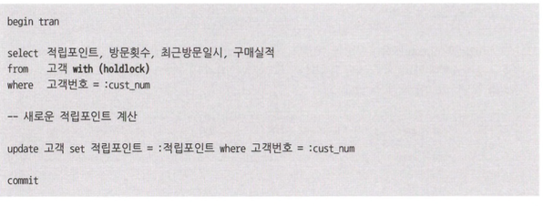
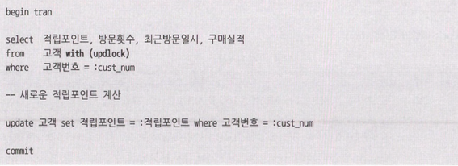
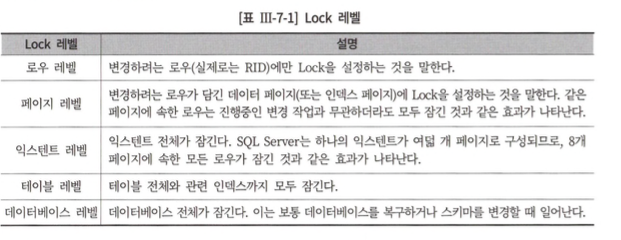
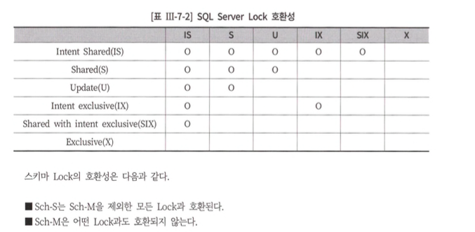
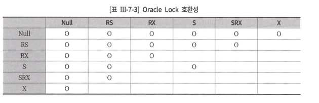

# 7장. Lock과 트랜잭션 동시성 제어

## 제 1절 Lock

- 다중 트랜잭션 환경에서 DB의 일관성과 무결성을 유지하기 위한 트랜잭션 순차적 진행을 보장
- 모든 DBMS가 공통적으로 사용

### 공유 Lock과 배타적 Lock

- `DBMS → 각 트랜잭션의 작업별로 적당한 수준으 Lock을 자동으로 설정`
- 필요 시, 사용자 설정 가능

1. 공유 Lock 
    - 데이터를 읽을 때 사용 (Read)
    - 다른 공유 Lock과 호환되나, 배타적 Lock과는 호환 x
        - **호환** : 한 자원에 2개 이상의 Lock을 동시 설정할 수 있음을 의미
        
        ⇒ 자신이 읽고있는 리소스를 다른 사용자가 Read할 수 있으나, 변경은 불가 
        
2. 배타적 Lock 
    - 데이터 변경 시에 사용
    - 트랜잭션 완료까지 유지
    - **Lock 해제 시까지 타 트랜잭션의 리소스 접근을 불허 (Read & Write 금지)**

### 블로킹과 교착상태

1. 블로킹
    1. Lock 경합이 발생해 특정 세션이 작업을 진행하지 못하고 멈춰선 상태 
    2. 공유 Lock끼리는 발생 X
2. 교착상태 
    1. 두 세션이 각각 Lock을 설정한 리소스를 서로 접근하려하는 상황

### SQL Server Lock

1. 공유 Lock 
- 테이블 힌트 holdlock 지정
    - 격리성 수준 변경없이 트랜잭션 내에서 공유 Lock 유지
        

    

      

1. 배타적 Lock 
2. 갱신 Lock
    - 데드락 상태 방지를 위한 기능
    - 테이블에 updlock 힌트를 사용
        

    

      

`**한 자원에 대한 갱신 Lock은 한 트랜잭션만 설정 가능**`

1. 의도 Lock 
2. 스키마 Lock
    1. Sch-S : SQL 컴파일 시, 오브젝트 스키마 참조시 발생, Read중 스키마를 변경 | 삭제 불가 
    2. Sch-M : DDL 수행중 발생, 수정 중인 스키마 정보를 다른 세션 참조X 
3. Bulk Update Lock
    1. 말그대로 벌크카피시 발생

    

      

- lock Escalation
    - 관리할 Lock 리소스가 정해진 임계치를 넘으면서 로우 레벨 락이 페이지, 익스텐트, 테이블 레벨 락으로 점점 확장되는 것을 말한다.

    

      

### 오라클 Lock

- `많은 레코드 갱신 시에도 lock Escalation는 없음`

1. Row Lock 
2. 테이블 Lock 

    

      

## 제 3절 동시성 제어

### 비관적 동시성 제어 vs 낙관적 동시성 제어

1. 비관적 동시성 제어 
    1. 데이터 Read시점에 Lock
    2. SQL Server에서 비관적 동시성 제어를 구현할 때는 holdlock이나 updlock 힌트를 사용하는 것이 편리하다.
2. 낙관적 동시성 제어
    1. 데이터 Read시에 No Lock 
    2. 수정 시점에 다른 사용자에 의해 값 변경을 반드시 체크해!